# AI JobShield — End-to-End Application Workflow

This document provides the definitive architectural workflow tracing the complete journey of user data and execution control through **AI JobShield**, from onboarding to analysis, review, and historical tracking.

---

## 1. High-Level Lifecycle Flow

The complete system lifecycle follows a structured 16-stage pipeline:

```
[User]
   │
   ▼
1. Register Account / Sign In
   │
   ▼
2. Email OTP Verification (via SMTP Relay)
   │
   ▼
3. Authenticated Session & Dashboard Access (JWT Bearer Token)
   │
   ▼
4. Ingestion Selection: Manual Input  OR  Screenshot Upload
   │
   ├──────────────────────────────┬──────────────────────────────┐
   ▼                              ▼                              ▼
[Manual Input]             [Image Upload]               [Relevance Gate]
Enter fields directly       Tesseract OCR extraction     Rejects non-job content
   │                              │                              │
   └──────────────────────────────┴──────────────────────────────┘
                                  │
                                  ▼
5. Extract & Normalize Job Parameters (Title, Company, Description, Contact, URL)
   │
   ▼
6. Company Verification (Curated Registry & Domain Consistency Check)
   │
   ▼
7. URL & Source Security Analysis (Local Heuristics: TLD, Shortener, Punycode)
   │
   ▼
8. Scam & Red-Flag Detection (14 Deterministic Pattern Rules & Positives)
   │
   ▼
9. Machine Learning Classification (TF-IDF Vectorization + Logistic Regression)
   │
   ▼
10. Multi-Dimensional Credibility Scoring (25% Co + 20% Src + 15% Qlt + 30% Scm + 10% Cnt)
   │
   ▼
11. Evidence-Based Guardrail Hard Caps (Impersonation ≤ 25 | Scam ≤ 35 | Unverified ≤ 65)
   │
   ▼
12. Risk Classification (LOW: ≥ 75 | MEDIUM: 45–74 | HIGH: < 45)
   │
   ▼
13. Natural Language Explanation Generation (Markdown Rationale with Evidence)
   │
   ▼
14. Atomic Database Persistence (JobPosting, AnalysisResult, DuplicateMatch)
   │
   ▼
15. Interactive Result Presentation (Trust Gauge, 5D Breakdown, Red Flags)
   │
   ▼
16. Historical Archival & User Workspace (Isolated History, Stats, Feedback, Reports)
```

---

## 2. Detailed Stage-by-Stage Workflow

```mermaid
flowchart TD
    %% Onboarding
    Start([User Arrives at Platform]) --> CheckSession{Has Valid JWT Session?}
    CheckSession -- Yes --> EnterDashboard[Load User Security Dashboard]
    CheckSession -- No --> AuthSelection{Select Authentication}

    AuthSelection -- Register --> FormRegister[Fill Name, Email, Password]
    FormRegister --> SendOTP[Backend Dispatches 6-Digit OTP via SMTP]
    SendOTP --> InputOTP[Enter OTP in Verification Modal]
    InputOTP -- Valid OTP --> IssueToken[Issue Signed JWT Bearer Token]
    InputOTP -- Invalid OTP --> ResendCheck{Attempts < 5?}
    ResendCheck -- Yes --> RetryOTP[Try Again or Click Resend]
    RetryOTP --> InputOTP
    ResendCheck -- No --> Lockout[Temporary Brute-Force Lockout]

    AuthSelection -- Login --> FormLogin[Enter Email & Password]
    FormLogin --> CheckPassword{Valid Password & Verified?}
    CheckPassword -- Yes --> IssueToken
    CheckPassword -- No --> LoginError[Display Invalid Credentials Alert]

    IssueToken --> EnterDashboard

    %% Ingestion
    EnterDashboard --> SelectAction{User Chooses Action}
    SelectAction -- Manual Analysis --> PageManual[Navigate to AnalyzePage]
    SelectAction -- OCR Screenshot --> PageOCR[Navigate to OcrPage]
    SelectAction -- View History --> PageHistory[Navigate to HistoryPage]
    SelectAction -- View Profile --> PageProfile[Navigate to ProfilePage]

    %% OCR Pipeline
    PageOCR --> UploadScreenshot[Upload Screenshot / Recruiter Chat Image]
    UploadScreenshot --> ProcessTesseract[Tesseract OCR Preprocessing & Extraction]
    ProcessTesseract --> GateCheck{Job Content Validator<br/>Score ≥ 8 & Distinct ≥ 3<br/>& Anti-Score < 6?}
    GateCheck -- No: Contest / Shopping / Other --> RejectImage[422 Rejection: 'Image does not contain job content']
    RejectImage --> PageOCR
    GateCheck -- Yes: Valid Job Content --> PopulatePayload[Populate Extracted Text & Metadata Hints]

    %% Manual Pipeline
    PageManual --> InputFields[Enter Title, Company, Description, Salary, Email, URL]
    InputFields --> PopulatePayload

    %% Analytical Engine
    subgraph AnalyticalPipeline ["AI JobShield Analytical Engine (app/services/)"]
        PopulatePayload --> Step1[1. Company Verification: Check Registry & Domain Mismatch]
        Step1 --> Step2[2. URL Heuristics: Analyze Suspicious TLDs, IP Host, Shorteners]
        Step2 --> Step3[3. Rule Engine: Match 14 Scam Regex Patterns & Positive Legitimacy Cues]
        Step3 --> Step4[4. ML Service: TF-IDF n-grams + SGD Logistic Classifier]
        Step4 --> Step5[5. 5D Scoring: Weighted Sum across Company, Source, Quality, Scam, Contact]
        Step5 --> Step6[6. Hard Caps: Enforce Non-Negotiable Safety Limits]
        Step6 --> Step7[7. Risk Tier: Classify as LOW ≥75, MEDIUM 45-74, HIGH <45]
        Step7 --> Step8[8. Explainability: Generate Markdown Rationale with Evidence]
        Step8 --> Step9[9. Deduplication: Compute Cosine Similarity against Past Postings]
    end

    %% Persistence
    AnalyticalPipeline --> BeginDB[Begin Atomic Database Transaction]
    BeginDB --> WritePosting[INSERT into job_postings]
    WritePosting --> WriteAnalysis[INSERT into analysis_results]
    WriteAnalysis --> WriteDuplicates[INSERT into duplicate_matches if near duplicate]
    WriteDuplicates --> CommitDB[COMMIT Transaction]

    %% UI Presentation
    CommitDB --> RenderResult[Display ResultPage: Trust Gauge, 5D Breakdown, Red Flags]

    %% Post-Analysis User Actions
    RenderResult --> UserActionChoice{User Decision}
    UserActionChoice -- Provide Feedback --> SendFeedback[Submit Correct / Incorrect Feedback]
    UserActionChoice -- Report Scam --> SendReport[Submit Community Scam Report]
    UserActionChoice -- Browse Scans --> PageHistory

    %% Workspace Operations
    PageHistory --> FilterHistory[Filter by Risk Tier / Search Keyword]
    PageHistory --> InspectPast[Inspect Previous Analysis Result]
    PageHistory --> DeletePast[Permanently Delete User Scan Record]

    PageProfile --> ViewStats[View Personal Scan Count, Trust Average, Account Age]
```



---

## 3. Workflow Steps Explanation

### Step 1: User Onboarding & Email Verification
* **Purpose**: Prevents disposable bot sign-ups, automated scraping, and identity spoofing.
* **Mechanism**: Users register with email and password. A 6-digit numeric OTP is generated, hashed with SHA-256, and delivered via SMTP. The user must supply the matching OTP within 15 minutes before login access is granted.

### Step 2: Ingestion & Relevance Gatekeeper
* **Manual Input**: Form parameters are validated against Pydantic schemas (min 30 characters of job text required).
* **Screenshot OCR**: Image is preprocessed with grayscale and adaptive scaling. Tesseract OCR extracts text. `job_content_validator.py` applies a relevance gate: non-job images (e.g., Codeforces coding problems, shopping carts, Instagram stories) are rejected with a clear user-facing message, preventing non-job records from entering the database.

### Step 3: Multi-Track Intelligence Gathering
* **Company Verification**: Cross-references employer name against `verified_companies.json`. Validates whether recruiter email domain (`@infosys.com`) matches official corporate domains. Flags brand impersonation when a known company is paired with a free email (`@gmail.com`).
* **URL Heuristics**: Analyzes link syntax for suspicious indicators (top-level domains like `.xyz`, `.top`, punycode, URL shorteners, raw IP addresses, and brand mismatches) without live fetching.
* **Rule Engine**: Evaluates 14 deterministic scam rules covering upfront fees, equipment costs, sensitive ID solicitations, and WhatsApp-only hiring.
* **Machine Learning Model**: Evaluates natural language scam probability using TF-IDF tokenization and a calibrated linear classifier.

### Step 4: Transparent 5D Scoring & Guardrail Hard Caps
* **Dimensional Weighting**:
  1. Company Verification: 25%
  2. Job / Source Credibility: 20%
  3. Job Posting Quality: 15%
  4. Scam & Red Flag Detection: 30%
  5. Contact Domain Consistency: 10%
* **Evidence-Based Caps**:
  * Impersonation Risk: Capped at **≤ 25/100** (High Risk).
  * Critical Scam Flag: Capped at **≤ 35/100** (High Risk).
  * Unverified Company: Capped at **≤ 65/100** (Cannot be Low Risk).
  * Partially Verified Company: Capped at **≤ 75/100**.

### Step 5: Explainable Synthesis & Storage
* `explain.py` generates human-readable explanations detailing primary risk factors, positive indicators, and actionable safety tips.
* Transactional database write records the `JobPosting`, `AnalysisResult`, and any identified `DuplicateMatch` records atomically.

### Step 6: User Workspace & History Isolation
* The user reviews results on `ResultPage` featuring the interactive `TrustGauge`.
* Scans are automatically stored in the user's isolated history (`HistoryPage`), where candidates can browse, filter, inspect past analyses, or permanently delete records.
