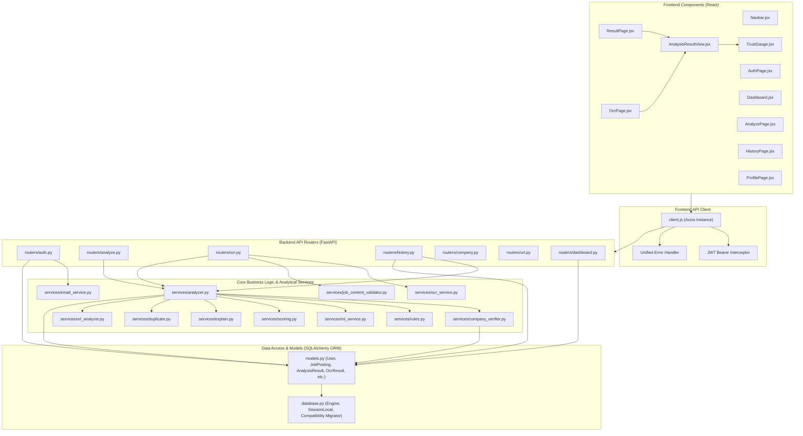

# AI JobShield — Component Diagram

This document illustrates the internal component modularity of **AI JobShield**, highlighting the separation of concerns across presentation, routing, business logic, security rules, and data access.

---

## Component Modularity Diagram

---

## Component Interfaces & Data Responsibilities

| Component | Responsibility | Inputs | Outputs |
| :--- | :--- | :--- | :--- |
| **`analyzer.py`** | Coordinates posting validation, heuristic analysis, score calculation, and persistent storage. | Raw job parameters, `user_id`, DB session | Normalized `AnalysisResult` dictionary |
| **`company_verifier.py`** | Verifies employer identity against curated registries; detects corporate impersonation. | Company name, recruiter email, website URL | Status (`VERIFIED`, `UNVERIFIED`, `IMPERSONATION_RISK`), reasons, dimension score |
| **`rules.py`** | Deterministic keyword and regex rule execution detecting scam indicators. | Job text, salary, email, URL | Red flag list, positive indicator list, bonus points |
| **`ml_service.py`** | Evaluates job postings with a trained Scikit-Learn TF-IDF classifier. | Concatenated job text | Scam probability (0.0 to 1.0), top influential terms |
| **`scoring.py`** | Transparent 5-dimensional weighted trust rating bounded by evidence-based caps. | Dimension outputs, flags, positives, ML probability | Final Trust Score (0–100), Risk Level (`LOW`, `MEDIUM`, `HIGH`), score breakdown |
| **`explain.py`** | Builds human-readable structured explanations with transparent reasons. | Trust score, risk level, flags, positives, cap reasons | Multi-section structured markdown text |
| **`ocr_service.py`** | Image preprocessing and text extraction via Tesseract OCR. | Image bytes, filename, content type | Extracted text, confidence rating, metadata hints |
