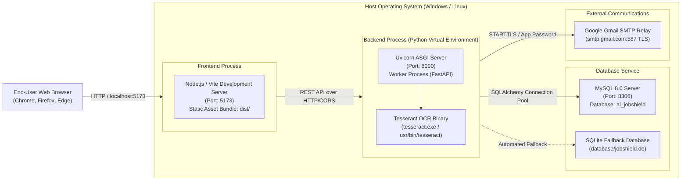

# AI JobShield — Deployment Architecture

This document describes the runtime infrastructure, process isolation, environment configurations, and deployment topologies for **AI JobShield**.

---

## 1. Physical / Process Deployment Topology

---

## 2. Infrastructure Details

### Frontend Runtime
* **Runtime**: Node.js v18+ / Vite v8
* **Development Mode**: `npm run dev` running on `http://localhost:5173` with Hot Module Replacement (HMR).
* **Production Mode**: `npm run build` generating an optimized single-page static distribution in `frontend/dist/`, servable via Nginx, Caddy, or FastAPI static file mount.
* **CORS**: Configured on FastAPI backend allowing requests from `http://localhost:5173`, `http://127.0.0.1:5173`, and configured deployment domains.

### Backend Application Runtime
* **Runtime**: Python 3.10+ isolated inside a virtual environment (`venv/`).
* **Server**: Uvicorn ASGI server running asynchronous event loops via AnyIO.
* **OCR Binary Dependency**: System Tesseract OCR executable located at `C:\Program Files\Tesseract-OCR\tesseract.exe` or resolved from system `$PATH`.
* **Logging**: Structured application logging writing to stdout and rotating file logs with timestamp, route, user context, and elapsed latency.

### Database Service
* **Primary Target**: MySQL 8.0+ on port 3306 with UTF8MB4 collation for full Unicode support.
* **Zero-Configuration Fallback**: SQLite 3 database (`database/jobshield.db`) utilized automatically when MySQL credentials are not configured or during lightweight test runner environments (`tests/test_*.py`).
* **Connection Pooling**: SQLAlchemy `QueuePool` with health-check pings (`pool_pre_ping=True`) ensuring stale connections are re-established without throwing 500 errors.

### Mail Delivery & Notification
* **SMTP Service**: Google Gmail SMTP (`smtp.gmail.com:587`) utilizing 16-character Google App Passwords over TLS.
* **Test Runner Fallback**: In test environments or when SMTP credentials are intentionally omitted, the backend activates `SMTP_CONSOLE_FALLBACK=True`, outputting verification codes directly to secure server logs without crashing.
