# AI JobShield — System Architecture

This document describes the high-level system architecture of **AI JobShield**, detailing component responsibilities, network boundaries, architectural tiers, and inter-service data flows.

---

## 1. Architectural Overview

AI JobShield is built as a decoupled, multi-tier cybersecurity application designed to analyze online job postings, detect recruitment fraud, and provide explainable credibility scoring.

```mermaid
graph TD
    subgraph ClientLayer ["1. Client Presentation Layer (Browser)"]
        SPA["React 18 Single-Page Application (Vite Bundler)"]
        Tailwind["Tailwind CSS Modern Theme"]
        Gauges["Interactive Trust Gauge (SVG) & Recharts"]
        AuthCtx["AuthContext & API Client (Axios + JWT Interceptors)"]
        SPA --> Tailwind
        SPA --> Gauges
        SPA --> AuthCtx
    end

    subgraph APILayer ["2. API & Ingestion Gateway Layer (FastAPI)"]
        AppMain["app/main.py (ASGI Application & Lifespan)"]
        CORSMiddleware["CORS Middleware (Configured Origins)"]
        RateLimiter["In-Memory Rate Limiter (Brute-Force Guard)"]

        subgraph Routers ["API Routers"]
            RouterAuth["/api/auth (JWT, Bcrypt, Email OTP)"]
            RouterAnalyze["/api/analyze (Job Ingestion & Parsing)"]
            RouterOCR["/api/ocr (Image Upload & Gate Validator)"]
            RouterHistory["/api/history (Paginated User-Isolated History)"]
            RouterCompany["/api/company (Verification Engine)"]
            RouterURL["/api/url (Local Security Heuristics)"]
            RouterDash["/api/dashboard (Aggregated Metrics)"]
            RouterReports["/api/reports (Community Scam Reports)"]
            RouterFeedback["/api/feedback (Model Accuracy Feedback)"]
        end

        AppMain --> CORSMiddleware
        AppMain --> RateLimiter
        AppMain --> Routers
    end

    subgraph CoreEngine ["3. Core Analytical & Intelligence Engines (app/services/)"]
        OCRService["OCR Pipeline (Tesseract OCR Engine)"]
        GateValidator["Job Content Relevance Validator"]
        CompanyVerifier["Company Registry & Domain Matcher"]
        UrlAnalyzer["Local URL Security Heuristic Inspector"]
        RuleEngine["Deterministic Rule Engine (14 Risk Indicators)"]
        MLEngine["TF-IDF + SGD Logistic Regression Classifier"]
        ScoringEngine["5-Dimensional Weighted Scoring Engine"]
        ExplainEngine["Natural Language Explainability Builder"]
        DuplicateService["TF-IDF Cosine Deduplication Engine"]
        EmailService["SMTP Delivery & OTP Verification Service"]
    end

    subgraph DataLayer ["4. Data & Storage Layer"]
        MySQL[("Relational Database (MySQL 8.0 / SQLite 3)")]
        VerifiedJSON[("Curated Enterprise Database (JSON)")]
        FreeDomainsJSON[("Free Email Providers Database (JSON)")]
        SuspiciousTLDs[("Suspicious TLDs Database (JSON)")]
        TrainedModel[("Serialized ML Model (jobshield_model.joblib)")]
        ImageStorage["Local Secure Image Storage (/uploads)"]
    end

    subgraph ExternalServices ["5. External Subsystems"]
        TesseractBinary["System Tesseract OCR Binary (tesseract.exe)"]
        SMTPRelay["Google Gmail SMTP Relay (smtp.gmail.com:587 TLS)"]
    end

    %% Client to API
    AuthCtx -->|Bearer JWT HTTP Requests| RouterAuth
    AuthCtx -->|Job Details Payload| RouterAnalyze
    AuthCtx -->|Multipart Image Form| RouterOCR
    AuthCtx -->|Filtered Query Params| RouterHistory
    AuthCtx -->|Company Query| RouterCompany
    AuthCtx -->|URL String| RouterURL
    AuthCtx -->|Stats Query| RouterDash
    AuthCtx -->|Report Data| RouterReports
    AuthCtx -->|Feedback Label| RouterFeedback

    %% Gateway to Engines
    RouterOCR --> OCRService
    RouterOCR --> GateValidator
    OCRService --> ImageStorage
    OCRService --> TesseractBinary
    GateValidator --> RouterAnalyze

    RouterAuth --> EmailService
    EmailService --> SMTPRelay

    RouterAnalyze --> CompanyVerifier
    RouterAnalyze --> UrlAnalyzer
    RouterAnalyze --> RuleEngine
    RouterAnalyze --> MLEngine
    RouterAnalyze --> ScoringEngine
    RouterAnalyze --> ExplainEngine
    RouterAnalyze --> DuplicateService

    %% Engines to Knowledge & Data
    CompanyVerifier --> VerifiedJSON
    CompanyVerifier --> MySQL
    RuleEngine --> FreeDomainsJSON
    UrlAnalyzer --> SuspiciousTLDs
    MLEngine --> TrainedModel
    DuplicateService --> MySQL

    RouterAnalyze --> MySQL
    RouterHistory --> MySQL
    RouterAuth --> MySQL
    RouterDash --> MySQL
    RouterReports --> MySQL
    RouterFeedback --> MySQL
```



---

## 2. Multi-Tier Layer Breakdown

### Tier 1: Client Presentation Layer (Frontend)
* **Framework**: React 18 using modern functional components and hooks (`useState`, `useEffect`, `useContext`, `useCallback`).
* **Build System**: Vite 5.x delivering Hot Module Replacement (HMR) during development and tree-shaken static production bundles.
* **Styling & Design System**: Vanilla Tailwind CSS 3.x tailored with a cybersecurity color palette:
  * Primary Canvas: `bg-slate-900` / `bg-slate-950` with subtle glassmorphic container panels.
  * Status Accent: `emerald-500` (Low Risk / Safe), `amber-500` (Medium Risk / Caution), `rose-500` (High Risk / Danger).
* **State Management**: Centralized `AuthContext.jsx` tracking session validity, user profile data, and token lifecycle in browser `localStorage`.
* **API Communication**: Dedicated Axios client (`frontend/src/api/client.js`) configured with request interceptors injecting `Authorization: Bearer <token>` and response interceptors gracefully handling 401 unauthenticated transitions.

### Tier 2: API & Gateway Layer (FastAPI Backend)
* **Framework**: FastAPI (Python 3.10+) running asynchronously on the Uvicorn ASGI server.
* **Request Validation**: Pydantic v2 schemas (`app/schemas.py`) strictly validating types, string lengths, and email RFC structures before passing control to business handlers.
* **Security & Token Management**:
  * Passwords hashed with salted Bcrypt (minimum 8 characters with letter and number/special character requirements).
  * Stateless session authorization using HMAC-SHA256 signed JSON Web Tokens (JWT) with configured 24-hour expiration.
  * In-memory sliding-window rate limiters protecting authentication endpoints from brute-force password guessing and OTP enumeration.
* **CORS Policy**: Configured `CORSMiddleware` restricting cross-origin requests to configured frontend origins.

### Tier 3: Core Analytical & Intelligence Engines
1. **OCR Pipeline (`ocr_service.py`)**: Preprocesses uploaded screenshots (grayscale conversion, adaptive scaling, point-contrast thresholding) and extracts text via Tesseract OCR.
2. **Relevance Gatekeeper (`job_content_validator.py`)**: Filters non-job imagery prior to analytical ingestion, ensuring coding problems, shopping receipts, and memes are rejected early.
3. **Company Verifier (`company_verifier.py`)**: Cross-checks claimed employers against enterprise registries (`verified_companies.json`), detecting corporate impersonation when known enterprises are paired with personal webmail (`@gmail.com`).
4. **URL Analyzer (`url_analyzer.py`)**: Inspects links using 10+ local security heuristics (TLD reputation, shorteners, punycode, raw IP addresses, and brand mismatches) without live fetching.
5. **Deterministic Rule Engine (`rules.py`)**: Executes 14 regex patterns detecting upfront fees, equipment purchase requests, sensitive ID solicitations, and WhatsApp-only hiring.
6. **Machine Learning Model (`ml_service.py`)**: Evaluates natural language scam probability using TF-IDF tokenization and a calibrated linear classifier.
7. **5-Dimensional Scoring Engine (`scoring.py`)**: Aggregates dimensional scores (Company 25%, Source 20%, Quality 15%, Scam 30%, Contact 10%) and applies strict evidence-based safety caps.
8. **Explainability Engine (`explain.py`)**: Synthesizes structured markdown explanations detailing positive indicators, red flags with verbatim evidence, and actionable advice.

### Tier 4: Persistence & Data Layer
* **Primary Relational Engine**: MySQL 8.0 (production) / SQLite 3 (testing and local fallback) managed via SQLAlchemy 2.0 ORM.
* **Relational Entities**: 9 database tables (`users`, `email_otps`, `companies`, `job_postings`, `analysis_results`, `ocr_results`, `scam_reports`, `feedback`, `duplicate_matches`).
* **Curated Offline Knowledge Stores**:
  * `verified_companies.json`: Verified enterprise names, aliases, and official domains.
  * `free_email_domains.json`: Comprehensive catalog of free and personal webmail providers.
  * `suspicious_tlds.json`: List of free, high-abuse top-level domains.
  * `models/jobshield_model.joblib`: Serialized TF-IDF vectorizer and trained Logistic Regression pipeline.
  * `uploads/`: Secure local storage of uploaded screenshot artifacts with cryptographically random UUID names.

---

## 3. Security Perimeter & Trust Boundaries

```
[ UNTRUSTED ZONE ]                 [ TRUSTED GATEWAY ]                  [ SECURE CORE ]
User Browser / Internet  ──HTTPS──>  FastAPI API Gateway  ──In-Memory──>  Analytical Engines
(Untrusted Input)                    - Schema Validation                  - Deterministic Rules
                                     - JWT Bearer Guard                   - ML Inference
                                     - Brute-Force Rate Limiter           - 5D Scoring & Caps
                                                                                  │
                                                                       SQLAlchemy Connection
                                                                                  ▼
                                                                       Relational Database
                                                                       (Encrypted at Rest)
```

1. **Client Boundary**: All user inputs (job text, URLs, uploaded images) are treated as untrusted data and strictly sanitized.
2. **Gateway Boundary**: Routes requiring authentication verify signed JWT Bearer tokens before handler execution.
3. **Database Boundary**: Parameterized queries generated by SQLAlchemy 2.0 ORM prevent SQL injection vulnerabilities across all query pathways.
4. **Data Isolation**: All scan records enforce strict user scoping (`WHERE user_id = :current_user_id`), guaranteeing candidate privacy.
