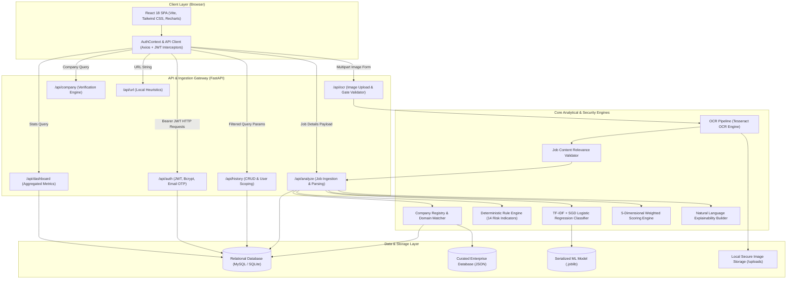

# AI JobShield — System Architecture

This document describes the high-level system architecture of **AI JobShield**, detailing component responsibilities, network boundaries, and inter-service data flows.

---

## 1. Architectural Overview

AI JobShield is built as a decoupled, multi-tier security application designed to analyze online job postings, detect recruitment fraud, and provide explainable credibility scoring.

---

## 2. Layer Breakdown

### A. Client Presentation Layer (Frontend)
* **Framework**: React 18 with Vite bundling.
* **Styling**: Tailwind CSS tailored with a modern cybersecurity theme (`paper`, `ink`, `mist`, `accent`, `safe`, `warn`, `danger`).
* **State & Authentication**: Context-driven authentication (`AuthContext.jsx`) persisting Bearer tokens in secure local storage and attaching them to outgoing Axios requests.
* **Visualization**: Interactive SVG gauges (`TrustGauge.jsx`) and Recharts charts (`Dashboard.jsx`) illustrating risk distribution and historical trends.

### B. Application Gateway Layer (FastAPI Backend)
* **Framework**: FastAPI (Python 3.10+) running asynchronously via Uvicorn.
* **Authentication & Authorization**: OAuth2 Bearer token authentication with HMAC-SHA256 signature verification and Bcrypt password hashing.
* **Rate Limiting & Security**: In-memory sliding-window rate limiters protecting authentication, OTP requests, and login attempts against brute-force attacks.

### C. Analytical & Intelligence Engines
1. **OCR Extraction Pipeline**: Tesseract OCR extracts text from uploaded screenshots, resumes, or recruiter chat transcripts.
2. **Relevance Gatekeeper**: `job_content_validator.py` filters non-job imagery prior to ingestion.
3. **Company Verifier**: Cross-checks claimed employers against enterprise registries, validating domain consistency (`@company.com`) versus personal webmail (`@gmail.com`).
4. **Deterministic Rule Engine**: Flags suspicious patterns including upfront registration fees, equipment payment requests, sensitive ID solicitations, and WhatsApp-only recruitment.
5. **Machine Learning Model**: Evaluates natural language scam probability using TF-IDF tokenization and a calibrated linear classifier.
6. **5-Dimensional Scoring Engine**: Computes a transparent credibility rating bounded by strict safety caps.
7. **Explainability Engine**: Translates raw numerical dimensions into structured, natural language rationale.

### D. Persistence Layer
* **Database**: MySQL (production) / SQLite (testing & local fallback) managed via SQLAlchemy 2.0 ORM.
* **Tables**: `users`, `job_postings`, `analysis_results`, `ocr_results`, `companies`, `email_otps`, `scam_reports`, `feedbacks`, and `duplicate_matches`.
* **Static Corpora**: Curated lists of verified enterprise domains, free email providers, and suspicious top-level domains.
