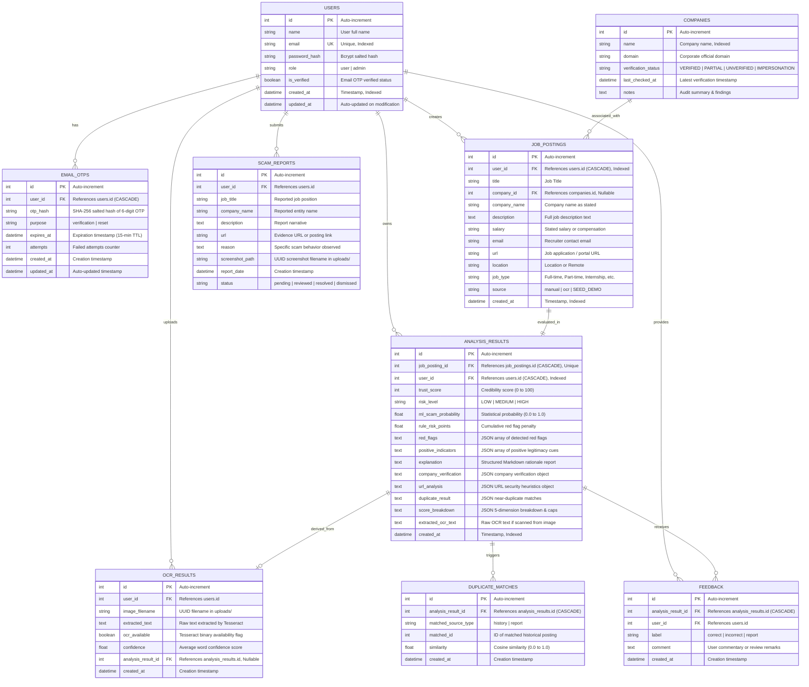

# AI JobShield — Database Design & Entity-Relationship (ER) Documentation

This document specifies the complete relational schema, entity dictionary, foreign key constraints, JSON storage schemas, indexing strategies, and database lifecycle for **AI JobShield**.

---

## 1. Entity-Relationship Diagram



---

## 2. Comprehensive Entity Data Dictionary

### Table: `users`
Stores system accounts, credential hashes, and verification statuses.

| Column | Data Type | Nullable | Constraints & Defaults | Description |
| :--- | :--- | :---: | :--- | :--- |
| `id` | `INTEGER` | No | Primary Key, Autoincrement | Unique internal user identifier. |
| `name` | `VARCHAR(120)` | No | — | Candidate full name. |
| `email` | `VARCHAR(255)` | No | Unique, Indexed | Normalized email address used for login and notifications. |
| `password_hash`| `VARCHAR(255)` | No | — | Salted password hash generated via Bcrypt. |
| `is_verified` | `BOOLEAN` | No | Default: `False` | Account verification status confirmed via Email OTP. |
| `role` | `VARCHAR(20)` | No | Default: `'user'` | Role-based authorization (`'user'`, `'admin'`). |
| `created_at` | `DATETIME(TZ)` | No | Default: `utcnow()` | Registration timestamp. |
| `updated_at` | `DATETIME(TZ)` | No | Default: `utcnow()`, onupdate | Timestamp of last profile update. |

---

### Table: `email_otps`
Manages short-lived one-time passwords for account verification and password resets.

| Column | Data Type | Nullable | Constraints & Defaults | Description |
| :--- | :--- | :---: | :--- | :--- |
| `id` | `INTEGER` | No | Primary Key, Autoincrement | OTP record identifier. |
| `user_id` | `INTEGER` | No | Foreign Key (`users.id`, `CASCADE`) | Owner user reference. |
| `otp_hash` | `VARCHAR(255)` | No | — | Salted SHA-256 hash of the 6-digit numeric OTP. |
| `purpose` | `VARCHAR(40)` | No | Default: `'verification'` | Token purpose (`'verification'`, `'reset'`). |
| `expires_at` | `DATETIME(TZ)` | No | — | Expiration timestamp (15-minute validity window). |
| `attempts` | `INTEGER` | No | Default: `0` | Number of failed attempts (locks out after 5 failures). |
| `created_at` | `DATETIME(TZ)` | No | Default: `utcnow()` | Generation timestamp. |
| `updated_at` | `DATETIME(TZ)` | No | Default: `utcnow()`, onupdate | Timestamp of last validation attempt. |

---

### Table: `companies`
Caches company identification records and corporate domain verification audits.

| Column | Data Type | Nullable | Constraints & Defaults | Description |
| :--- | :--- | :---: | :--- | :--- |
| `id` | `INTEGER` | No | Primary Key, Autoincrement | Company record identifier. |
| `name` | `VARCHAR(255)` | No | Indexed | Official registered name of the enterprise. |
| `domain` | `VARCHAR(255)` | Yes | — | Official corporate domain (e.g. `infosys.com`). |
| `verification_status` | `VARCHAR(40)` | No | Default: `'UNABLE TO VERIFY'` | Status (`VERIFIED`, `PARTIALLY VERIFIED`, `UNVERIFIED`, `IMPERSONATION_RISK`). |
| `last_checked_at` | `DATETIME(TZ)` | Yes | — | Timestamp of most recent verification check. |
| `notes` | `TEXT` | Yes | — | Audit summary and evidence details. |

---

### Table: `job_postings`
Stores raw job posting parameters submitted for evaluation.

| Column | Data Type | Nullable | Constraints & Defaults | Description |
| :--- | :--- | :---: | :--- | :--- |
| `id` | `INTEGER` | No | Primary Key, Autoincrement | Job posting identifier. |
| `user_id` | `INTEGER` | No | Foreign Key (`users.id`, `CASCADE`), Indexed | User who submitted the posting. |
| `title` | `VARCHAR(255)` | No | — | Job title. |
| `company_id` | `INTEGER` | Yes | Foreign Key (`companies.id`) | Linked recognized company entity (if matched). |
| `company_name` | `VARCHAR(255)` | No | — | Employer name as stated in the posting. |
| `description` | `TEXT` | No | — | Full job description text (minimum 30 chars). |
| `salary` | `VARCHAR(120)` | Yes | — | Stated salary or compensation terms. |
| `email` | `VARCHAR(255)` | Yes | — | Contact email address of the recruiter. |
| `url` | `VARCHAR(500)` | Yes | — | Application URL or job portal link. |
| `location` | `VARCHAR(255)` | Yes | — | Job location or "Remote". |
| `job_type` | `VARCHAR(80)` | Yes | — | Employment type (Full-time, Internship, etc.). |
| `source` | `VARCHAR(20)` | No | Default: `'manual'` | Ingestion origin (`'manual'`, `'ocr'`, `'SEED_DEMO'`). |
| `created_at` | `DATETIME(TZ)` | No | Default: `utcnow()`, Indexed | Ingestion timestamp. |

---

### Table: `analysis_results`
Stores the full analytical evaluation, credibility score, and explainability breakdown.

| Column | Data Type | Nullable | Constraints & Defaults | Description |
| :--- | :--- | :---: | :--- | :--- |
| `id` | `INTEGER` | No | Primary Key, Autoincrement | Analysis record identifier. |
| `job_posting_id`| `INTEGER` | No | Foreign Key (`job_postings.id`, `CASCADE`), Unique | Linked job posting (1:1 relationship). |
| `user_id` | `INTEGER` | No | Foreign Key (`users.id`, `CASCADE`), Indexed | Owner user ID for user isolation. |
| `trust_score` | `INTEGER` | No | Check: `0 ≤ trust_score ≤ 100` | Computed multi-dimensional credibility rating. |
| `risk_level` | `VARCHAR(20)` | No | — | Risk category (`'LOW'`, `'MEDIUM'`, `'HIGH'`). |
| `ml_scam_probability` | `FLOAT` | Yes | — | Calibrated statistical scam probability (0.0 to 1.0). |
| `rule_risk_points` | `FLOAT` | No | Default: `0.0` | Cumulative penalty points from triggered heuristic rules. |
| `red_flags` | `TEXT` | No | Default: `'[]'` | Serialized JSON array of detected red flags with evidence. |
| `positive_indicators` | `TEXT` | No | Default: `'[]'` | Serialized JSON array of detected positive legitimacy cues. |
| `explanation` | `TEXT` | No | Default: `''` | Structured Markdown natural language explanation report. |
| `company_verification` | `TEXT` | No | Default: `'{}'` | Serialized JSON object of company verification details. |
| `url_analysis` | `TEXT` | No | Default: `'{}'` | Serialized JSON object of URL security heuristics. |
| `duplicate_result` | `TEXT` | No | Default: `'{}'` | Serialized JSON object of near-duplicate matches. |
| `score_breakdown` | `TEXT` | No | Default: `'{}'` | Serialized JSON object of 5D dimensional scores and caps. |
| `extracted_ocr_text` | `TEXT` | Yes | — | Raw OCR text if ingestion was performed via screenshot. |
| `created_at` | `DATETIME(TZ)` | No | Default: `utcnow()`, Indexed | Creation timestamp. |

---

### Table: `ocr_results`
Persists optical character recognition extractions and uploaded file metadata.

| Column | Data Type | Nullable | Constraints & Defaults | Description |
| :--- | :--- | :---: | :--- | :--- |
| `id` | `INTEGER` | No | Primary Key, Autoincrement | OCR record identifier. |
| `user_id` | `INTEGER` | No | Foreign Key (`users.id`) | User who uploaded the image. |
| `image_filename`| `VARCHAR(255)`| No | — | Sanitized UUID filename in `uploads/` folder. |
| `extracted_text`| `TEXT` | No | Default: `''` | Text output recognized by Tesseract. |
| `ocr_available`| `BOOLEAN` | No | Default: `True` | Flag indicating if local Tesseract engine was active. |
| `confidence` | `FLOAT` | Yes | — | Word-level average confidence score (0 to 100%). |
| `analysis_result_id`| `INTEGER` | Yes | Foreign Key (`analysis_results.id`) | Linked analysis result (if auto-analyzed). |
| `created_at` | `DATETIME(TZ)` | No | Default: `utcnow()` | Upload timestamp. |

---

### Table: `duplicate_matches`
Tracks near-duplicate job postings identified via TF-IDF cosine similarity.

| Column | Data Type | Nullable | Constraints & Defaults | Description |
| :--- | :--- | :---: | :--- | :--- |
| `id` | `INTEGER` | No | Primary Key, Autoincrement | Duplicate record identifier. |
| `analysis_result_id`| `INTEGER` | No | Foreign Key (`analysis_results.id`, `CASCADE`) | Linked analysis result. |
| `matched_source_type`| `VARCHAR(40)`| No | — | Origin of match (`'history'`, `'report'`). |
| `matched_id` | `INTEGER` | No | — | ID of the matched historical posting. |
| `similarity` | `FLOAT` | No | — | Cosine similarity score (0.0 to 1.0). |
| `created_at` | `DATETIME(TZ)` | No | Default: `utcnow()` | Match timestamp. |

---

### Table: `feedback`
Collects candidate feedback regarding analysis correctness.

| Column | Data Type | Nullable | Constraints & Defaults | Description |
| :--- | :--- | :---: | :--- | :--- |
| `id` | `INTEGER` | No | Primary Key, Autoincrement | Feedback identifier. |
| `analysis_result_id`| `INTEGER` | No | Foreign Key (`analysis_results.id`, `CASCADE`) | Linked analysis result. |
| `user_id` | `INTEGER` | No | Foreign Key (`users.id`) | User submitting feedback. |
| `label` | `VARCHAR(20)` | No | — | Feedback label (`'correct'`, `'incorrect'`, `'report'`). |
| `comment` | `TEXT` | Yes | — | Optional commentary or reasoning. |
| `created_at` | `DATETIME(TZ)` | No | Default: `utcnow()` | Submission timestamp. |

---

### Table: `scam_reports`
Maintains community-submitted reports of fraudulent recruiting activity.

| Column | Data Type | Nullable | Constraints & Defaults | Description |
| :--- | :--- | :---: | :--- | :--- |
| `id` | `INTEGER` | No | Primary Key, Autoincrement | Report identifier. |
| `user_id` | `INTEGER` | No | Foreign Key (`users.id`) | Reporting user identifier. |
| `job_title` | `VARCHAR(255)` | No | — | Title of reported fraudulent role. |
| `company_name` | `VARCHAR(255)` | No | — | Claimed entity or recruiter name. |
| `description` | `TEXT` | No | — | Narrative description of fraudulent conduct. |
| `url` | `VARCHAR(500)` | Yes | — | Proof link or job URL. |
| `reason` | `TEXT` | No | — | Specific violation (e.g. "Asked for registration fee"). |
| `screenshot_path`| `VARCHAR(255)`| Yes | — | Linked proof screenshot path. |
| `report_date` | `DATETIME(TZ)` | No | Default: `utcnow()` | Submission timestamp. |
| `status` | `VARCHAR(20)` | No | Default: `'pending'` | Review status (`'pending'`, `'reviewed'`, `'resolved'`, `'dismissed'`). |

---

## 3. Database Indexes & Query Performance

The database implements targeted indexes to optimize query execution and enforce tenant privacy:

| Table | Index Name | Indexed Columns | Justification / Query Target |
| :--- | :--- | :--- | :--- |
| `users` | `ix_users_email` | `email` (Unique) | Sub-millisecond credential lookup during login (`WHERE email = :email`). |
| `analysis_results` | `ix_analysis_results_user_id` | `user_id` | Guarantees fast user isolation filtering (`WHERE user_id = :id`). |
| `analysis_results` | `ix_analysis_results_created_at` | `created_at` | Enables fast descending sorting for paginated history queries. |
| `job_postings` | `ix_job_postings_user_id` | `user_id` | Speeds up analytical joins between postings and analyses. |
| `companies` | `ix_companies_name` | `name` | Rapid employer identification during company verification. |
| `feedback` | `uq_feedback_user_analysis` | `(analysis_result_id, user_id)` | Unique constraint preventing duplicate feedback submissions by the same user. |

---

## 4. JSON Payload Schemas (Stored Fields)

Several columns in `analysis_results` store structured JSON to preserve detailed evaluation evidence:

### `score_breakdown` JSON Schema
```json
{
  "dimensions": {
    "company_verification": { "score": 95.0, "weight": 0.25, "status": "VERIFIED", "label": "Company Verification" },
    "source_credibility": { "score": 90.0, "weight": 0.20, "label": "Source & URL Credibility" },
    "job_posting_quality": { "score": 85.0, "weight": 0.15, "label": "Job Posting Quality" },
    "scam_detection": { "score": 88.0, "weight": 0.30, "label": "Scam & Red Flag Detection" },
    "contact_consistency": { "score": 95.0, "weight": 0.10, "label": "Contact & Domain Consistency" }
  },
  "raw_weighted_score": 90.5,
  "red_flag_points": [],
  "raw_rule_points": 0,
  "positive_bonus": 25,
  "ml_available": true,
  "ml_scam_probability": 0.08,
  "cap_applied": false,
  "cap_reason": null,
  "trust_score": 91,
  "risk_level": "LOW",
  "formula": "25% Company + 20% Source + 15% Quality + 30% Scam + 10% Contact; bounded by evidence-based caps"
}
```

### `red_flags` JSON Schema
```json
[
  {
    "id": "fee_request",
    "label": "Upfront fee / pay-to-join request",
    "severity": "critical",
    "points": 35,
    "evidence": "pay registration fee of 1499 via UPI to join"
  },
  {
    "id": "suspicious_contact",
    "label": "Suspicious contact method (WhatsApp/Telegram-only)",
    "severity": "high",
    "points": 15,
    "evidence": "Contact on WhatsApp only"
  }
]
```
