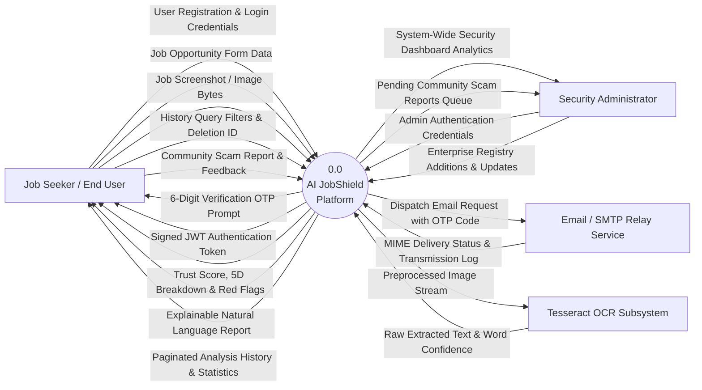

# AI JobShield — Data Flow Diagrams (DFD)

This document presents the complete hierarchy of Data Flow Diagrams for **AI JobShield**, adhering to standard structured analysis principles (Yourdon & DeMarco notation).

---

## 1. Context-Level DFD (Level 0)

The Context Diagram represents the entire **AI JobShield** platform as a single centralized software process (Process 0.0), showing all external entities that produce data for or consume information from the system.



### Context Data Dictionary
* **User Registration & Login Credentials**: Plaintext name, email, password string, and purpose identifier.
* **Job Opportunity Form Data**: Title, company name, raw description, salary phrase, contact email, destination URL, location, and job type.
* **Job Screenshot / Image Bytes**: Binary payload of uploaded PNG, JPG, or WEBP document (≤ 5 MB).
* **Trust Score, 5D Breakdown & Red Flags**: Numerical credibility rating (0–100), risk tier (`LOW`, `MEDIUM`, `HIGH`), dimensional ratings, and triggered heuristic rules.
* **Explainable Natural Language Report**: Structured markdown report providing human-readable context, evidence rationale, and security recommendations.

---

## 2. Level-0 DFD: Major System Processes & Data Stores

The Level-0 DFD decomposes Process 0.0 into its eight primary operational processes and maps the six core data stores.

```mermaid
graph TD
    %% External Entities
    User["Job Seeker / Candidate"]
    Admin["Security Administrator"]
    SMTP["Email / SMTP Relay"]
    Tesseract["Tesseract OCR Engine"]

    %% Data Stores
    D1[("D1: Users & Email OTPs")]
    D2[("D2: Verified Enterprise Registry")]
    D3[("D3: Job Postings & Upload Artifacts")]
    D4[("D4: Analysis Results & Matches")]
    D5[("D5: Community Reports & Feedback")]
    D6[("D6: Trained ML Model Weights")]

    %% Processes
    P1(("1.0<br/>User Authentication<br/>& Email Verification"))
    P2(("2.0<br/>Image Preprocessing<br/>& OCR Ingestion"))
    P3(("3.0<br/>Job Content<br/>Validation Gate"))
    P4(("4.0<br/>Company & URL<br/>Verification"))
    P5(("5.0<br/>Rule-Based<br/>Scam Detection"))
    P6(("6.0<br/>Machine Learning<br/>Classification"))
    P7(("7.0<br/>5D Scoring &<br/>Explainability Engine"))
    P8(("8.0<br/>History & Dashboard<br/>Analytics Management"))

    %% Process 1.0 Data Flows
    User -->|Sign-up / Login Request| P1
    P1 -->|Dispatch OTP Code| SMTP
    SMTP -->|Delivery Status| P1
    P1 <-->|Read / Write User Credentials & Hashes| D1
    P1 -->|JWT Session Token| User

    %% Process 2.0 & 3.0 OCR Flows
    User -->|Upload Job Screenshot| P2
    P2 -->|Image Stream| Tesseract
    Tesseract -->|Raw Text & Confidence| P2
    P2 -->|Save Upload Metadata| D3
    P2 -->|Extracted Text| P3
    P3 -->|Rejection Message (Invalid Content)| User
    P3 -->|Validated Job Content String| P4

    %% Process 4.0 Company & URL
    User -->|Manual Job Parameters| P4
    P4 <-->|Query Enterprise Names & Domains| D2
    P4 -->|Company Status & Domain Mismatch Flag| P7
    P4 -->|URL Security Risk & Heuristic Indicators| P7

    %% Process 5.0 & 6.0 Analytical Engines
    P4 -->|Normalized Job Text & Metadata| P5
    P5 -->|Triggered Red Flags & Positive Bonuses| P7

    P4 -->|Job Text String| P6
    D6 -->|TF-IDF Vocabulary & Logistic Weights| P6
    P6 -->|Scam Probability & Top 8 Terms| P7

    %% Process 7.0 Scoring & Persistence
    P7 -->|Compute 5D Score & Apply Hard Caps| P7
    P7 -->|Structured Job Posting Record| D3
    P7 -->|Analysis Result Record & Breakdown| D4
    P7 -->|Final Evaluation Report & Trust Gauge| User

    %% Process 8.0 History & Dashboard
    User -->|Query Filter / Delete Record Request| P8
    P8 <-->|Read User-Scoped Analyses| D4
    P8 <-->|Read Scam Reports & Feedback| D5
    P8 -->|Paginated History List| User
    P8 -->|Personal Security Stats| User
    Admin -->|Query Platform Analytics| P8
    P8 -->|System-Wide Aggregated Metrics| Admin
    Admin -->|Update Enterprise Records| D2
```

---

## 3. Level-1 DFD: Subsystem Decomposition of Process 7.0 (Job Analysis & Risk Evaluation)

This diagram details the core analytical engine that ingests job details, validates consistency, runs heuristic and machine learning scoring, enforces guardrail hard caps, and generates explainable output.

```mermaid
graph TD
    %% Inputs
    InJob["Job Posting Data<br/>(from Manual Form or OCR Gate)"]
    InUser["Current User ID<br/>(from Bearer JWT)"]

    %% Data Stores
    D2[("D2: Verified Enterprise Registry")]
    D3[("D3: Job Postings")]
    D4[("D4: Analysis Results")]
    D6[("D6: ML Model & Weights")]

    %% Sub-processes of 7.0
    P7_1(("7.1<br/>Input Normalization<br/>& Field Parsing"))
    P7_2(("7.2<br/>Company Identification<br/>& Domain Matching"))
    P7_3(("7.3<br/>URL Security Heuristic<br/>Inspection"))
    P7_4(("7.4<br/>Deterministic Pattern<br/>& Rule Evaluation"))
    P7_5(("7.5<br/>TF-IDF Vectorization<br/>& ML Inference"))
    P7_6(("7.6<br/>5-Dimensional Weighted<br/>Score Aggregation"))
    P7_7(("7.7<br/>Guardrail Hard Cap<br/>Enforcement"))
    P7_8(("7.8<br/>Natural Language Rationale<br/>Synthesis"))
    P7_9(("7.9<br/>Database Persistence<br/>& History Archival"))

    %% Step 1: Normalization
    InJob -->|Raw Form Parameters| P7_1
    InUser --> P7_1
    P7_1 -->|Normalized Job Title & Company Name| P7_2
    P7_1 -->|Job URL String| P7_3
    P7_1 -->|Full Job Description Text| P7_4
    P7_1 -->|Job Text String| P7_5
    P7_1 -->|Posting Entity Attributes| P7_9

    %% Step 2: Company Verification
    P7_2 <-->|Read Known Enterprise Records & Aliases| D2
    P7_2 -->|Company Status: VERIFIED / PARTIAL / UNVERIFIED / IMPERSONATION| P7_6
    P7_2 -->|Company Verification Summary & Reasons| P7_8

    %% Step 3: URL Inspection
    P7_3 -->|URL Risk Score, Valid Flag & Indicators| P7_6
    P7_3 -->|URL Findings Rationale| P7_8

    %% Step 4: Rule Engine
    P7_4 -->|14 Scam Rule Patterns| P7_4
    P7_4 -->|Triggered Red Flags List & Positive Indicators| P7_6
    P7_4 -->|Flag Evidence Snippets| P7_8

    %% Step 5: ML Inference
    D6 -->|Trained Pipeline Weights| P7_5
    P7_5 -->|Scam Probability Score (0.0 to 1.0)| P7_6
    P7_5 -->|Top 8 Influential Vocabulary Features| P7_8

    %% Step 6: 5D Scoring
    P7_6 -->|Raw Weighted Score: 25% Co + 20% Src + 15% Qlt + 30% Scm + 10% Cnt| P7_7

    %% Step 7: Hard Caps
    P7_7 -->|Enforce Safety Constraints:<br/>Impersonation <= 25 | Critical Scam <= 35 | Unverified <= 65| P7_7
    P7_7 -->|Final Trust Score (0-100) & Risk Tier (LOW/MED/HIGH)| P7_8
    P7_7 -->|Score Breakdown & Applied Cap Reasons| P7_9

    %% Step 8: Explanation Builder
    P7_8 -->|Structured Markdown Explanation Report| P7_9

    %% Step 9: Persistence & Output
    P7_9 -->|Insert Job Posting Record| D3
    P7_9 -->|Insert Analysis Result Record| D4
    P7_9 -->|Serialized Complete Evaluation JSON| OutView["Output: Interactive Evaluation View<br/>(Trust Gauge, 5D Breakdown, Red Flags, Rationale)"]
```

---

## 4. DFD Notation & Semantic Rules

| DFD Element | Symbol Representation | Semantic Meaning | System Implementation Example |
| :--- | :--- | :--- | :--- |
| **External Entity** | Square Box `[Entity]` | A person, organization, or external system that lies outside the boundary of AI JobShield but produces or receives data. | Job Seeker, Security Admin, Tesseract OCR Binary, Google SMTP Relay. |
| **Process** | Circle / Rounded Rectangle `((Process))` | An activity or transformation that takes incoming data flows, manipulates or evaluates them, and produces outgoing data flows. | `1.0 User Authentication`, `6.0 ML Classification`, `7.6 5D Score Aggregation`. |
| **Data Store** | Double Line / Open Bracket `[("Store")]` | A repository of data at rest, either in persistent relational storage or serialized on disk. | `D1: users`, `D2: verified_companies.json`, `D3: job_postings`, `D4: analysis_results`. |
| **Data Flow** | Directed Labeled Arrow `-->|Data|` | A pathway conveying discrete, structured packets of data between entities, processes, and stores. | `Credentials Payload`, `Scam Probability Metrics`, `Trust Score & Red Flags`. |
