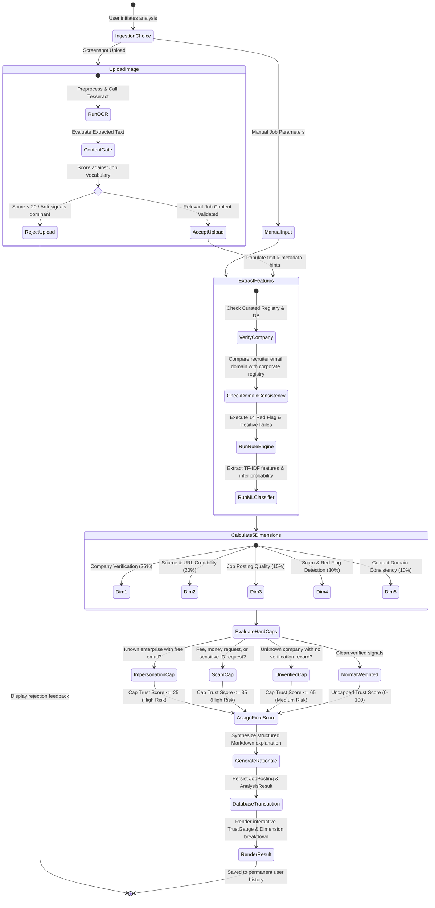

# AI JobShield — Activity Diagram

This document illustrates the operational activity flow of the job opportunity evaluation process, showing decisions, branching, and state transitions.

---

## Activity Flow Diagram

