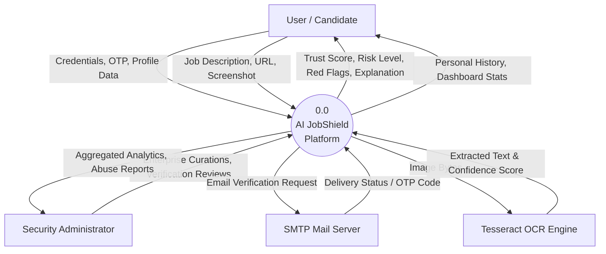

# AI JobShield — Data Flow Diagrams (DFD)

This document presents both the **Level 0 (Context Level)** and **Level 1 (Detailed Subsystem)** Data Flow Diagrams for **AI JobShield**.

---

## 1. Level 0: Context Level Diagram

The Level 0 DFD illustrates external entities interacting with the AI JobShield boundary and the high-level inputs and outputs exchanged.



---

## 2. Level 1: Subsystem Data Flow Diagram

The Level 1 DFD decomposes the system into core operational processes, data stores, and directional data pathways.

```mermaid
graph TD
    User["Job Seeker"]

    %% Processes
    P1(("1.0<br/>Auth & Session<br/>Management"))
    P2(("2.0<br/>Image Preprocessing<br/>& OCR Extraction"))
    P3(("3.0<br/>Job Content<br/>Validation Gate"))
    P4(("4.0<br/>Company & Domain<br/>Verification"))
    P5(("5.0<br/>Rule-Based<br/>Scam Detection"))
    P6(("6.0<br/>Machine Learning<br/>Inference"))
    P7(("7.0<br/>5D Scoring &<br/>Explainability"))
    P8(("8.0<br/>History & Report<br/>Persistence"))

    %% Data Stores
    D1[("D1: Users & Auth Credentials")]
    D2[("D2: Verified Enterprise Registry")]
    D3[("D3: Job Postings & OCR Artifacts")]
    D4[("D4: Analysis Results & History")]
    D5[("D5: ML Model Weights")]

    %% Process 1: Auth
    User -->|Sign-up / Login Request| P1
    P1 -->|Read / Write User Profile & Salted Hash| D1
    P1 -->|JWT Bearer Token| User

    %% Process 2 & 3: OCR
    User -->|Job Screenshot / Image| P2
    P2 -->|Raw Text & Confidence| P3
    P3 -->|Rejected non-job content| User
    P3 -->|Validated Job Text| P4
    P3 -->|Save Upload Record| D3

    %% Manual Ingestion
    User -->|Manual Job Parameters| P4

    %% Process 4: Company Verification
    P4 -->|Query Company Name & Domain| D2
    D2 -->|Enterprise Record / Aliases| P4
    P4 -->|Company Verification Status & Reasons| P7

    %% Process 5 & 6: Rules & ML
    P4 -->|Job Payload| P5
    P4 -->|Job Text String| P6
    P6 -->|Query Trained Vocab & Weights| D5
    P5 -->|Red Flags & Positive Indicators| P7
    P6 -->|Scam Probability & Top Terms| P7

    %% Process 7: Scoring
    P7 -->|5-Dimension Weighted Rating & Caps| P8
    P7 -->|Interactive Score, Risk & Explanations| User

    %% Process 8: Persistence
    P8 -->|Store Posting & Ingestion Source| D3
    P8 -->|Store Analysis, Score, Flags, Explanations| D4

    %% History Query
    User -->|Fetch History (Scoped by User ID)| P8
    D4 -->|User-Scoped Past Analyses| P8
    P8 -->|Paginated History Records| User
```
