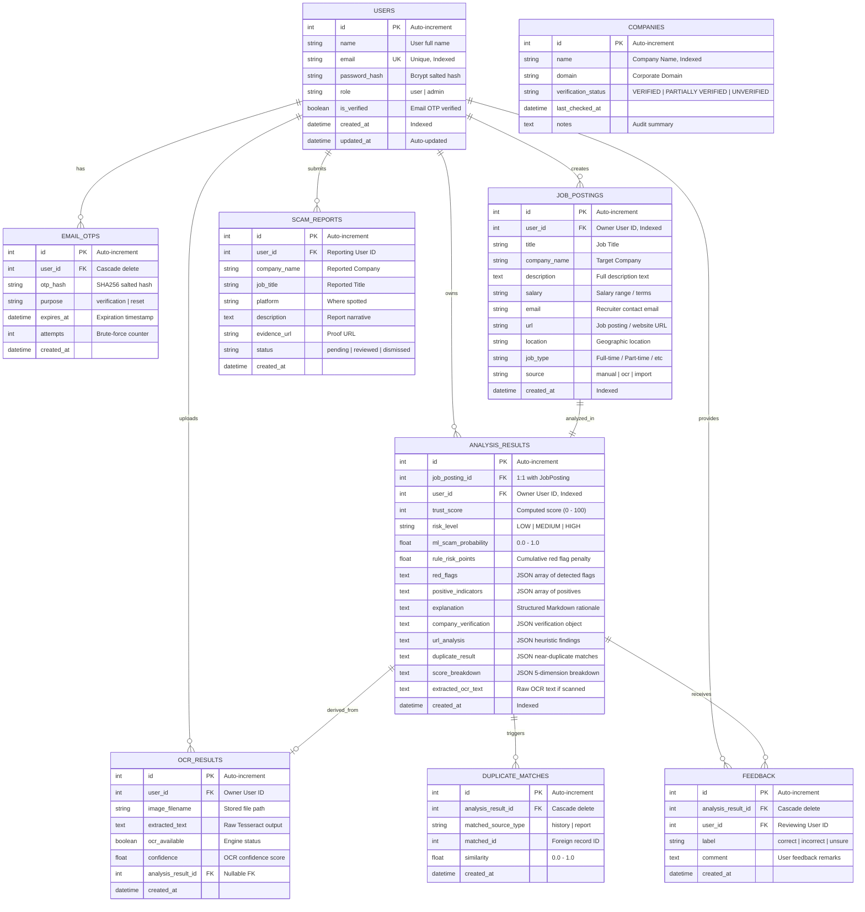

# AI JobShield — Entity-Relationship (ER) Diagram

This document specifies the database schema, relational cardinalities, foreign key constraints, and indexing strategies implemented in **AI JobShield**.

---

## 1. Entity-Relationship Diagram

---

## 2. Relational Integrity & Performance Optimizations

1. **Foreign Key Constraints**:
   * All child tables (`job_postings`, `analysis_results`, `email_otps`, `ocr_results`, `scam_reports`, `feedbacks`) enforce foreign key relationships referencing `users(id)`.
   * When an `AnalysisResult` is deleted, related records in `duplicate_matches` and `feedback` are automatically removed via `cascade="all, delete-orphan"`.
2. **Database Indexing**:
   * `users.email`: Unique index enabling sub-millisecond authentication lookups.
   * `analysis_results.user_id`: Index enabling fast user-scoped query filtering (`WHERE user_id = :id`).
   * `analysis_results.created_at`: Index enabling efficient descending sorting for paginated history retrieval.
   * `job_postings.user_id` & `job_postings.created_at`: Indexes enabling rapid analytical joins.
