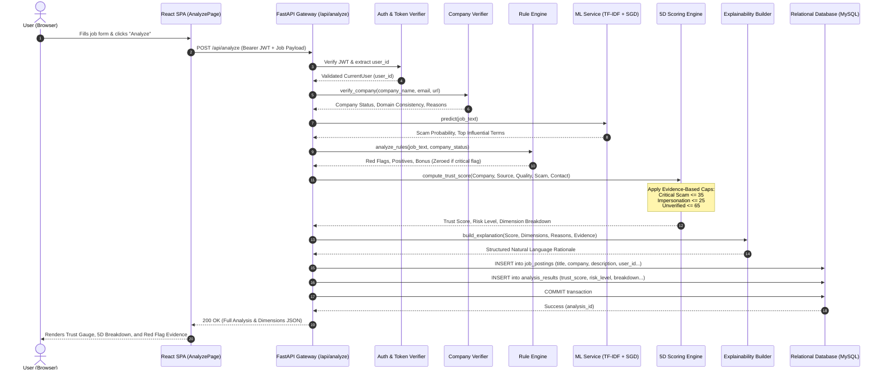
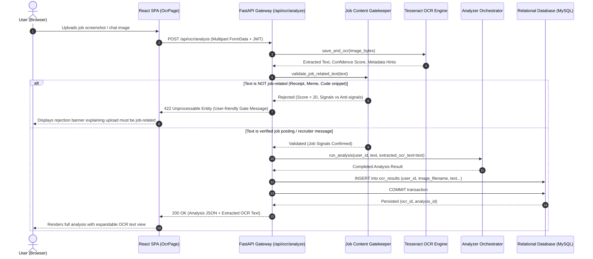

# AI JobShield — Sequence Diagrams

This document details the time-ordered interactions across the Client, Backend Gateway, Analytical Engines, and Database during core system workflows.

---

## 1. Sequence Diagram: Job Analysis & Evidence-Based Scoring

---

## 2. Sequence Diagram: OCR Screenshot Scanning Pipeline

