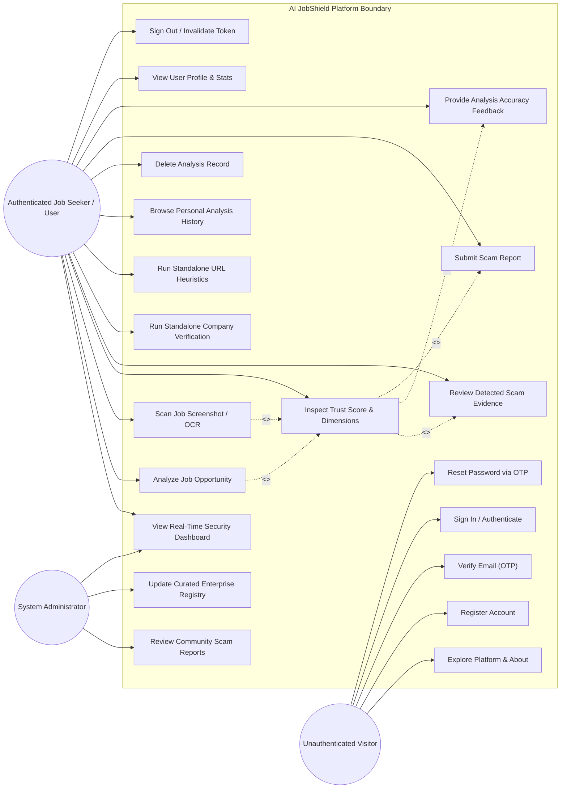

# AI JobShield — Use Case Diagram

This document defines the primary actors, functional use cases, and access boundaries within **AI JobShield**.

---

## 1. Use Case Diagram

---

## 2. Use Case Descriptions

| Use Case | Primary Actor | Pre-Conditions | Post-Conditions |
| :--- | :--- | :--- | :--- |
| **Analyze Job Opportunity** | Authenticated User | Valid JWT Bearer token, minimum 30 characters of job text | Analysis saved to database, multi-dimensional trust score rendered. |
| **Scan Job Screenshot (OCR)** | Authenticated User | Valid image file (PNG/JPG/WEBP, ≤ 5 MB) | Image text extracted, validated for relevance, analyzed, and linked to user history. |
| **Browse Analysis History** | Authenticated User | User logged in | Paginated list of user's past scans retrieved from database. |
| **Delete Analysis Record** | Authenticated User | User owns the target analysis record | Record and linked job posting safely deleted; cannot affect other users. |
| **View Profile** | Authenticated User | User logged in | Name, email, registration date, and aggregate scan breakdown rendered without exposing password. |
| **Company Verification** | Authenticated User | Company name entered | Registry matched status, domain consistency, and impersonation risk displayed. |
