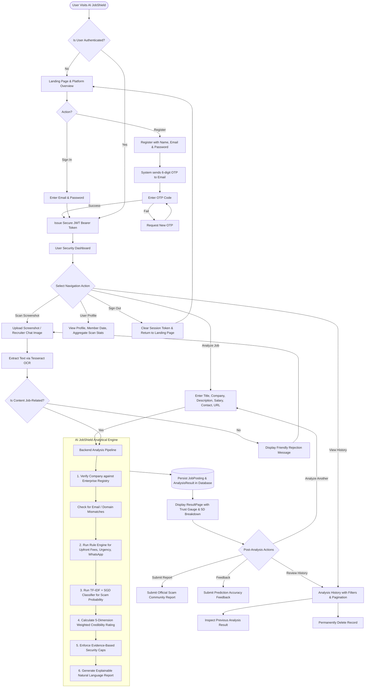

# AI JobShield — End-to-End Application Workflow

This document traces the complete user journey through **AI JobShield**, from onboarding to analysis, review, and historical tracking.

---

## Complete User Journey Flowchart

