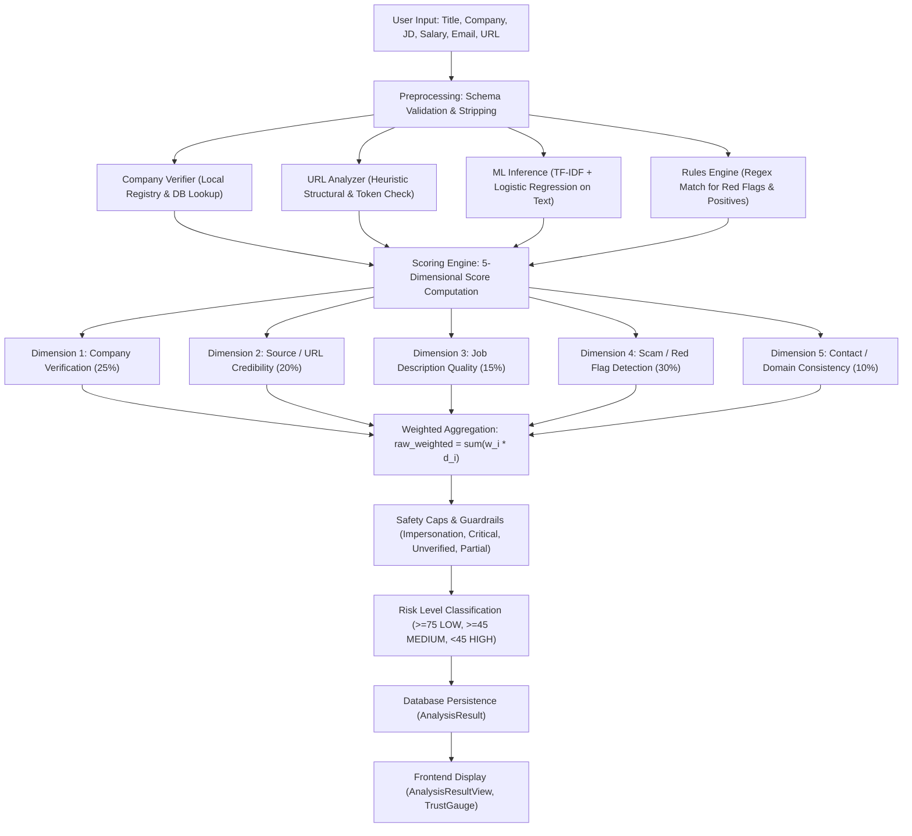

# AI JobShield Scoring System: Comprehensive Audit & Root Cause Analysis

**Audit Date:** 2026-10-03  
**Status:** READ-ONLY Architectural & Algorithmic Audit  
**Target Files:**
- `backend/app/services/scoring.py`
- `backend/app/services/rules.py`
- `backend/app/services/analyzer.py`
- `backend/app/services/company_verifier.py`
- `backend/app/services/ml_service.py`
- `backend/app/services/url_analyzer.py`
- `backend/app/schemas.py`
- `backend/app/models.py`
- `data/verified_companies.json`
- `data/free_email_domains.json`
- `data/suspicious_tlds.json`
- `backend/seed.py`
- `frontend/src/components/AnalysisResultView.jsx`
- `frontend/src/components/TrustGauge.jsx`
- `tests/test_history_and_scoring.py`

---

## Executive Summary

This audit investigates a critical calibration defect in AI JobShield:
> **Observed Defect:** A clearly fake recruitment posting receives **~74/100 (near LOW risk)**, while an authentic recruitment posting for **Tata Consultancy Services (TCS)** receives **~78/100 (barely LOW risk)** — an unacceptable **4-point delta** between a scam and a verified tier-1 enterprise posting.

### The Two Root Causes in Brief
1. **The Genuine TCS Suppression Root Cause (~78/100):**
   When analyzing `"Tata Consultancy Services"`, token-based matching in `rules.py` and `url_analyzer.py` performs a naive keyword intersection: `{"tata", "consultancy", "services"}` vs. `{"tcs", "com"}`. Because `tcs` does not share alphanumeric tokens with the full name, **both modules trigger false-positive domain and URL mismatch flags**, penalizing the genuine TCS posting by **-15 rule risk points in Dimension 4**, slashing Dimension 2 (Source Credibility) from **90.0 to 60.0**, dropping Dimension 5 (Contact Consistency) from **95.0 to 20.0**, and blocking the `official_email` positive indicator. This cascades into an unjust **~18-point reduction**.
2. **The Fake Job Inflation Root Cause (~74/100):**
   If a fake posting claims a well-known brand (e.g. TCS) or a partially verified entity, but omits the email and website URL from the structured input fields (e.g., providing contact only in the body text or deferring contact to a later interview step), `company_verifier.py` classifies it as `PARTIALLY VERIFIED` (base score 65). Because missing source URLs and contact details receive generous **neutral default baselines of 50.0/100**, posting quality defaults to **60.0 and climbs to 95.0** merely by containing copied responsibilities/qualifications boilerplate, and red-flag scam detection defaults to a perfect **100.0/100** when upfront fee keywords are absent, the weighted score aggregates to **73.7 ≈ 74/100**. The `PARTIALLY VERIFIED` safety cap of **75** fails to stop it.

---

## Complete Pipeline Trace



### 1. Input & Preprocessing
- **Schema (`backend/app/schemas.py` lines 178-195):** `AnalyzeRequest` receives `title`, `company_name`, `description` (min length 30), `salary`, `email`, `url`, `location`, `job_type`. Strips leading/trailing whitespace.
- **Orchestration (`backend/app/services/analyzer.py` lines 14-53):**
  - `url` is passed to `url_analyzer.analyze_url(url, company_name)`.
  - `company_name`, `email`, and `url` are passed to `company_verifier.verify_company(db, company_name, email, url)`.
  - Note: Free-text `description` is **never scanned** for embedded recruiter emails, telephone numbers, or URLs. If a scammer leaves the `email` form field empty and writes `"Email us at fake.tcs@gmail.com"` in the description, the contact verification pipeline receives `email=None`.
  - `ml_service.predict(f"{title} {company_name} {description} {salary or ''}")` receives title, company, description, and salary. `email` and `url` are excluded from the ML model input text.

### 2. Company Verification (`backend/app/services/company_verifier.py`)
- Searches `data/verified_companies.json` via `find_verified_company_match(name)`.
- Matches exact name, aliases (`aliases: ["tcs", "tata consultancy", "tcs ibegin"]`), and token subsets.
- **Outcome A (Known enterprise with matching official email/website domain):** Status `VERIFIED`, returns `"score": 95` (email) or `90` (website).
- **Outcome B (Known enterprise with free or non-matching recruiter domain):** Status `IMPERSONATION_RISK`, returns `"score": 15`.
- **Outcome C (Known enterprise, but neither email nor URL provided):** Lines 234-241: Status `PARTIALLY VERIFIED`, returns `"score": 65`.
- **Outcome D (Unknown company not in registry):** Status `UNVERIFIED`, returns `"score": 40` (or 30 if free email, 45 if custom domain).
- **Critical Implementation Defect (Line 306 vs `scoring.py` Line 39):**
  - `company_verifier.py` line 306 returns `"score": company_score`.
  - `scoring.py` line 39 checks: `if "company_score" in company_data and company_data["company_score"] is not None:`.
  - Because the key `"company_score"` does not exist in the dictionary, line 39 is **always False**. `scoring.py` falls back to the hardcoded `else` block based on status strings, completely discarding the fine-grained scores computed by `company_verifier.py`.

### 3. URL Analysis (`backend/app/services/url_analyzer.py`)
- Evaluates URL structure without network I/O: length (>100), `@` symbols, IP addresses, subdomains (>=4), hyphens/digits (>=6), keywords, shorteners, HTTP vs HTTPS, suspicious TLDs (`.xyz`, `.top`, etc.), punycode, non-ASCII characters.
- **Company Name Comparison (Lines 149-161):**
  - Tokenizes `company_name` via `_normalize_company()`: removes `{"pvt", "ltd", "limited", "inc", "llc", "the", "and", "of", "company", "co"}`.
  - Compares with hostname tokens.
  - **Does NOT check aliases or registry records.** If company is `"Tata Consultancy Services"`, company tokens are `{"tata", "consultancy", "services"}`. If URL is `https://www.tcs.com`, hostname tokens are `{"www", "tcs", "com"}`. Token intersection is **empty**. URL analyzer flags `company_mismatch` (+15 risk score) on the official TCS domain.

### 4. Contact / Email Analysis (`rules.py` & `scoring.py`)
- In `rules.py` lines 227-238:
  - If domain in `free_email_domains.json`: flags `free_email` (12 pts, medium).
  - Domain tokens vs. company tokens: `_company_tokens(company_name)` vs. domain tokens.
  - If no token intersection and not free email: flags `email_domain_mismatch` (15 pts, high).
  - **Does NOT use verified registry aliases.** For `"Tata Consultancy Services"` and `careers@tcs.com`, `{"tata", "consultancy", "services"} & {"tcs", "com"} == set()`. Triggers a false `email_domain_mismatch` flag.
  - Furthermore, if domain IS a free email, lines 236-237 trigger `email_domain_mismatch` as well, double-flagging both `free_email` (12 pts) and `email_domain_mismatch` (15 pts) for 27 red-flag points total.
  - In lines 288-294: Positives check requires token intersection to award `official_email`. Because the intersection is empty, the positive indicator is denied.

### 5. Deterministic Rules (`backend/app/services/rules.py`)
- Checks regex patterns for red flags: `fee_request` (35 pts), `money_transfer` (35 pts), `equipment_purchase` (35 pts), `company_impersonation` (35 pts), `sensitive_info` (30 pts), `unrealistic_salary` (20 pts), `suspicious_contact` (15 pts), `email_domain_mismatch` (15 pts), `free_email` (12 pts), `urgency` (10 pts), `no_interview` (12 pts), `vague_description` (10 pts), `caps_exclaim` (5 pts), `suspicious_url` (12 or 18 pts).
- Positive indicators: `detailed_responsibilities` (+5), `qualifications` (+5), `official_email` (+6), `https_url` (+3), `interview_process` (+5), `realistic_salary` (+3), `company_verified` (+5 or +2), `no_fee` (+4). Capped at 25 bonus points.
- Zeroes bonus if `has_critical` is true.

### 6. Machine Learning Inference (`backend/app/services/ml_service.py`)
- Preprocesses text: converts HTML tags, masks URLs, emails, money, numbers; normalizes whitespace.
- Transforms via TF-IDF vectorizer (ngram 1-2, sublinear_tf) and runs Logistic Regression.
- Outputs `scam_probability` $\in [0.0, 1.0]$ and top contributing TF-IDF terms.
- **Limitations:** Trained on small 400-row synthetic demo dataset (`data/demo_training_data.csv`). Does not evaluate structured fields (email, company registry, URL domain).

### 7. 5-Dimensional Scores (`backend/app/services/scoring.py`)
1. **Dimension 1: Company Verification (25% weight):**
   - If `VERIFIED`: 95.0
   - If `PARTIALLY VERIFIED`: 65.0
   - If `UNVERIFIED`: 40.0
   - If `IMPERSONATION_RISK`: 10.0
2. **Dimension 2: Source / URL Credibility (20% weight):**
   - If URL provided and `url_risk == "LOW"`: 90.0 (or 60.0 if `company_mismatch`)
   - If URL provided and `url_risk == "MEDIUM"`: 45.0
   - If URL provided and `url_risk == "HIGH"`: $\max(5.0, 100.0 - \text{risk\_score})$
   - If URL invalid: 15.0
   - **If NO URL provided:** Neutral baseline = **50.0**
3. **Dimension 3: Job Description Quality (15% weight):**
   - Baseline starts at **60.0**.
   - +15.0 for `detailed_responsibilities`
   - +15.0 for `qualifications`
   - +10.0 for `interview_process`
   - +10.0 for `realistic_salary`
   - -35.0 for `vague_description`, -15.0 for `caps_exclaim`
   - Clamped to $[15.0, 95.0]$. Standard professional boilerplate easily hits **95.0**.
4. **Dimension 4: Scam / Red Flag Detection (30% weight):**
   - Starts at **100.0**. Purely subtractive: $\text{rule\_scam\_score} = \text{clamp}(100.0 - \sum \text{flag\_points}, 0.0, 100.0)$.
   - If ML available: $\text{scam\_dim\_score} = 0.70 \times \text{rule\_scam\_score} + 0.30 \times (100.0 - 100 \times P_{\text{scam}})$.
   - If no red flag patterns matched, rule score is **100.0/100**.
5. **Dimension 5: Contact / Domain Consistency (10% weight):**
   - If `IMPERSONATION_RISK` / `company_impersonation`: 10.0
   - If `email_domain_mismatch`: 20.0
   - If `free_email`: 30.0
   - If `suspicious_contact`: 20.0
   - If `official_email`: 95.0
   - **If NO email provided:** Neutral baseline = **50.0**

### 8. Weighted Score Aggregation
$$\text{raw\_weighted} = 0.25 \times D_1 + 0.20 \times D_2 + 0.15 \times D_3 + 0.30 \times D_4 + 0.10 \times D_5$$
$$\text{trust\_score} = \text{round}(\text{raw\_weighted})$$
*Note:* The `positive_bonus` returned by `rules.py` is passed into `compute_trust_score` but is **never added** to `raw_weighted` (it is only stored in breakdown metadata).

### 9. Safety Caps & Guardrails
- **Impersonation Risk:** If `company_status == "IMPERSONATION_RISK"` or `company_impersonation` in flags $\to \text{trust\_score} = \min(\text{trust\_score}, 25)$.
- **Critical Scam:** If `has_critical_scam` (`fee_request`, `money_transfer`, `equipment_purchase`, `sensitive_info`, or severity `critical`) $\to \text{trust\_score} = \min(\text{trust\_score}, 35)$.
- **Unverified Company:** If `company_status == "UNVERIFIED"` $\to \text{if } \text{trust\_score} > 65 \text{ then } 65$.
- **Partially Verified Company:** If `company_status == "PARTIALLY VERIFIED"` $\to \text{if } \text{trust\_score} > 75 \text{ then } 75$.

### 10. Final Risk Level & Frontend Display
- Classification:
  - $\ge 75 \implies \text{LOW Risk}$ (Green)
  - $45 \dots 74 \implies \text{MEDIUM Risk}$ (Amber)
  - $< 45 \implies \text{HIGH Risk}$ (Red)
- Frontend (`AnalysisResultView.jsx`, `TrustGauge.jsx`): Renders SVG circular gauge, risk badge, 5 individual dimension progress bars, detected red flags, and positive evidence chips.

---

## Detailed Identification of Audit Points

### 1. Current Scoring Formula
$$\text{TrustScore} = \text{Clamp}\Big(\text{ApplyCaps}\Big(\text{Round}\Big(\sum_{i=1}^5 w_i \times D_i\Big)\Big), 0, 100\Big)$$
where:
$$\begin{aligned}
D_1 &= \text{Company Verification Score} \in [0, 100] \\
D_2 &= \text{Source Credibility Score} \in [0, 100] \\
D_3 &= \text{Job Posting Quality Score} \in [15, 95] \\
D_4 &= 0.70 \times \max(0, 100 - \sum \text{Points}_{\text{red\_flags}}) + 0.30 \times (100 - 100 \times P_{\text{ML}}) \\
D_5 &= \text{Contact Consistency Score} \in [0, 100]
\end{aligned}$$

### 2. Current Score Weights
| Dimension | Identifier | Weight | Scope |
|---|---|---|---|
| Dimension 1 | `company_verification` | **25%** ($w = 0.25$) | Registry match & domain correlation |
| Dimension 2 | `source_credibility` | **20%** ($w = 0.20$) | URL heuristic structure and safety |
| Dimension 3 | `job_posting_quality` | **15%** ($w = 0.15$) | Responsibilities, qualifications, format |
| Dimension 4 | `scam_detection` | **30%** ($w = 0.30$) | Rule points (70%) + ML inference (30%) |
| Dimension 5 | `contact_consistency` | **10%** ($w = 0.10$) | Recruiter email domain consistency |

### 3. All Positive Signals
Defined in `backend/app/services/rules.py` (lines 280-310) and mapped in `scoring.py`:
1. `detailed_responsibilities`: "Detailed responsibilities listed" (+5 rule bonus, +15.0 in Quality)
2. `qualifications`: "Qualifications / skills listed" (+5 rule bonus, +15.0 in Quality)
3. `official_email`: "Official-looking company-domain email" (+6 rule bonus, sets Contact to 95.0)
4. `https_url`: "HTTPS URL provided" (+3 rule bonus)
5. `interview_process`: "Interview / selection process mentioned" (+5 rule bonus, +10.0 in Quality)
6. `realistic_salary`: "Salary information looks plausible" (+3 rule bonus, +10.0 in Quality)
7. `company_verified`: "Company status: VERIFIED" (+5 bonus) or "PARTIALLY VERIFIED" (+2 bonus)
8. `no_fee`: "No upfront fee request detected" (+4 rule bonus)

*Note:* In `scoring.py`, `positive_bonus` is never added to `raw_weighted`. Only the presence of specific positive IDs in `positive_indicators` modifies Dimensions 3 and 5.

### 4. All Negative Signals
Defined in `backend/app/services/rules.py` `RULE_WEIGHTS` (lines 12-27):
1. `fee_request` (35 pts, severity: critical)
2. `money_transfer` (35 pts, severity: critical)
3. `equipment_purchase` (35 pts, severity: critical)
4. `company_impersonation` (35 pts, severity: critical)
5. `sensitive_info` (30 pts, severity: critical)
6. `unrealistic_salary` (20 pts, severity: high)
7. `suspicious_contact` (15 pts, severity: high)
8. `email_domain_mismatch` (15 pts, severity: high)
9. `free_email` (12 pts, severity: medium)
10. `urgency` (10 pts, severity: medium)
11. `no_interview` (12 pts, severity: medium)
12. `vague_description` (10 pts, severity: medium)
13. `caps_exclaim` (5 pts, severity: low)
14. `suspicious_url` (12 or 18 pts, severity: medium or high)

URL Heuristic Indicators (`backend/app/services/url_analyzer.py`):
- `long_url` (+8 risk), `at_sign` (+25 risk), `ip_host` (+30 risk), `subdomains` (+15 risk), `hyphen_digits` (+12 risk), `kw_<kw>` (+8 risk), `shortener` (+18 risk), `http` (+12 risk), `tld` (+22 risk), `punycode` (+25 risk), `lookalike` (+25 risk), `company_mismatch` (+15 risk).

### 5. All Critical Signals
Defined in `rules.py` and guarded in `scoring.py` (lines 156-164):
1. `fee_request`: Registration, training, joining fee, or security deposit.
2. `money_transfer`: Gift cards, cryptocurrency, UPI payment, Western Union.
3. `equipment_purchase`: Mandatory payment for laptops, home office kits, software licenses.
4. `company_impersonation`: Claimed brand paired with free email or mismatched domain.
5. `sensitive_info`: Solicitation of Aadhaar, PAN card, SSN, bank account numbers, OTP, CVV.
6. `company_status == "IMPERSONATION_RISK"`: Triggered by company verifier.

### 6. Existing Safety Caps
Defined in `backend/app/services/scoring.py` (lines 171-189):
| Guardrail Trigger | Condition | Applied Cap | Resulting Max Risk Level |
|---|---|---|---|
| **Impersonation Risk** | `status == "IMPERSONATION_RISK"` or `company_impersonation` in red flags | $\le 25$ | **HIGH** |
| **Critical Scam Indicator** | `has_critical_scam` (fee, money, equipment, sensitive info, critical severity) | $\le 35$ | **HIGH** |
| **Unverified Company** | `status == "UNVERIFIED"` or `None` | $\le 65$ | **MEDIUM** |
| **Partially Verified Company** | `status == "PARTIALLY VERIFIED"` | $\le 75$ | **LOW / MEDIUM Boundary** |

### 7. How ML Contributes
- **Pipeline:** Text is preprocessed into `text_clean` (HTML/URLs/emails masked, numbers abstracted, lowercase). Evaluated using TF-IDF Vectorizer + Logistic Regression.
- **Blending Formula (`scoring.py` line 109):**
  $$\text{Dimension 4 Score} = 0.70 \times \text{RuleScamScore} + 0.30 \times (100 - 100 \times P_{\text{scam}})$$
- **Effective Overall Weight:**
  $$\text{Effective ML Weight} = w_{\text{scam}} \times 0.30 = 0.30 \times 0.30 = \mathbf{0.09 \ (9.0\%)}$$
- The deterministic rules and heuristic dimensions control **91.0%** of the score.
- When ML is unavailable, its weight is 0% and rules take 100% of Dimension 4.

### 8. How Company Verification Contributes
- **Weight:** 25% ($w_{\text{company}} = 0.25$).
- **Registry Check (`data/verified_companies.json`):** Matches name against verified enterprises.
- **Lookup Bug:** `company_verifier.py` returns `"score": company_score`, but `scoring.py` checks for `"company_score"`. The numeric score is discarded and falls through to status defaults:
  - `VERIFIED` $\to 95.0$ (contributes $+23.75$ pts)
  - `PARTIALLY VERIFIED` $\to 65.0$ (contributes $+16.25$ pts)
  - `UNVERIFIED` $\to 40.0$ (contributes $+10.00$ pts)
  - `IMPERSONATION_RISK` $\to 10.0$ (contributes $+2.50$ pts)

### 9. How Email / Domain Verification Contributes
- Handled in `company_verifier.py`, `rules.py`, and `scoring.py` Dimension 5 (10% weight):
  - Recruiter domain matches official registry domain $\to$ Dimension 5 = 95.0 ($+9.5$ pts).
  - Recruiter uses `@gmail.com` for verified brand $\to$ `IMPERSONATION_RISK`, Dimension 5 = 10.0, score capped at 25.
  - Recruiter uses custom domain that fails token intersection $\to$ `email_domain_mismatch`, Dimension 5 = 20.0 ($+2.0$ pts).
  - **No email provided $\to$ Defaults to neutral 50.0 ($+5.0$ pts).**

### 10. Whether Missing Evidence is Treated Differently from Negative Evidence
- **YES. Missing evidence receives an unearned neutral-positive score, creating a massive vulnerability:**
  - **Missing URL:** Receives **50.0/100** in Dimension 2 ($+10.0$ weighted points).
  - **Missing Email:** Receives **50.0/100** in Dimension 5 ($+5.0$ weighted points).
  - **Missing Company Proof:** Claiming a real enterprise without any email/URL receives `PARTIALLY VERIFIED` with **65.0/100** in Dimension 1 ($+16.25$ weighted points).
  - **Missing Red Flags:** An omission of crude scam words yields **100.0/100** in Dimension 4 ($+30.0$ weighted points).
- **Paradoxical Penalty on Honest Data:**
  An authentic posting providing a valid `careers@tcs.com` address is penalized for an apparent mismatch, scoring **20.0/100** in Dimension 5 and losing 15 points in Dimension 4. A scammer who provides **no email at all** gets **50.0/100** in Dimension 5 and **100.0/100** in Dimension 4. **Omitting evidence yields a higher score than providing genuine credentials that fail naive regexes.**

### 11. Whether Critical Evidence Can Be Cancelled by Positive Evidence
- If a critical flag is triggered (`fee_request`, `money_transfer`, `equipment_purchase`, `sensitive_info`, `company_impersonation`), hard caps enforce:
  - Impersonation: $\le 25$
  - Other critical scam flags: $\le 35$
  - Positive bonus in `rules.py` is zeroed (`bonus = 0`).
- **HOWEVER:** If a scam is structured subtly — without upfront fee requests in the initial text (e.g. asking the applicant to contact via WhatsApp or Telegram for the next round) — **no critical flag is triggered**.
- In that scenario, positive signals in Dimension 3 (Quality = 95.0), clean scam detection (100.0), and neutral missing-evidence defaults (50.0) aggregate to **~74/100**, completely masking the total absence of verifiable company backing.

### 12. Whether the Same Signal is Double-Counted
- **YES. Multiple signals suffer from multi-counting:**
  1. **Free Email (`@gmail.com`):**
     - Counted as `free_email` in `rules.py` (-12 pts).
     - Counted as `email_domain_mismatch` in `rules.py` (-15 pts) because `gmail.com` lacks company tokens.
     - Counted as `IMPERSONATION_RISK` in `company_verifier.py`.
     - Counted as `company_impersonation` in `rules.py` (-35 pts).
     - Penalized in `scoring.py` Dimension 5 (drops to 10.0).
     - Total: A single free email can trigger **-62 rule points across 3 separate flags**.
  2. **URL Risk:**
     - Evaluated in `url_analyzer.py` to produce a risk score and risk level.
     - Penalizes Dimension 2 in `scoring.py` (drops score to 45.0, 15.0, or lower).
     - Counted AGAIN in `rules.py` (lines 268-270) as `suspicious_url` (-12 or -18 pts in Dimension 4).
  3. **Job Quality Attributes (Responsibilities, Qualifications, Interview):**
     - Counted in `rules.py` to accumulate `positive_bonus`.
     - Counted AGAIN in `scoring.py` to boost Dimension 3 (+15, +15, +10).
  4. **Domain Mismatch:**
     - Flagged in `rules.py` as `email_domain_mismatch` (-15 pts).
     - Penalizes Dimension 4 (-15 rule points).
     - Penalizes Dimension 5 (drops to 20.0).
     - Flagged in `url_analyzer.py` as `company_mismatch` (+15 risk score).
     - Penalizes Dimension 2 (drops from 90.0 to 60.0).

---

## Root Cause Deep Dives

### 13. Why a Fake Job Can Reach ~74/100
Consider a typical recruitment scam posting claiming to be from a well-known brand (or an unverified entity) that avoids crude upfront fee patterns:
```
Title: Online Data Entry / Operations Assistant
Company: Tata Consultancy Services
Description:
Tata Consultancy Services is hiring Operations Assistants for remote processing.
Key responsibilities include data verification, document processing, and spreadsheet management.
Qualifications: High school diploma or any graduate, basic English and computer skills.
The selection process consists of resume review and a telephonic interview round.
Salary: Rs 28,000 per month. Direct placement for freshers.
(Recruiter email / URL left blank in input form; WhatsApp number provided in text or contact deferred)
```

#### Step-by-Step Scoring Trace for this Fake Job:
1. **Company Verification (`company_verifier.py`):**
   - Company name matches `"Tata Consultancy Services"` in registry.
   - `email` is `None`, `website` is `None`.
   - Line 234 executes: Known company with no contact evidence $\to$ `status = "PARTIALLY VERIFIED"`, `company_score = 65`.
   - In `scoring.py` Dimension 1: `PARTIALLY VERIFIED` assigns **65.0**.
   - Weighted score: $0.25 \times 65.0 = \mathbf{16.25}$.
2. **Source / URL Credibility (`scoring.py` Dimension 2):**
   - No URL provided.
   - Line 76 executes: Missing URL receives neutral baseline of **50.0**.
   - Weighted score: $0.20 \times 50.0 = \mathbf{10.00}$.
3. **Job Description Quality (`scoring.py` Dimension 3):**
   - Baseline starts at 60.0.
   - Matches "responsibilities" (+15.0) and "qualifications" (+15.0) and "selection process" (+10.0).
   - Score: $60 + 15 + 15 + 10 = 100 \implies$ clamped to **95.0**.
   - Weighted score: $0.15 \times 95.0 = \mathbf{14.25}$.
4. **Scam / Red Flag Detection (`scoring.py` Dimension 4):**
   - Scammer did not ask for registration fees upfront in the posting text (fees are demanded after the victim makes contact).
   - Narrow regexes fail to match: `raw_points = 0`.
   - Rule scam score: $100.0 - 0 = 100.0$.
   - ML model on standard job keywords predicts low scam probability (e.g. $P \approx 0.20 \implies \text{ml\_scam\_score} = 80.0$).
   - Blended Dimension 4: $0.70 \times 100.0 + 0.30 \times 80.0 = \mathbf{94.0}$.
   - Weighted score: $0.30 \times 94.0 = \mathbf{28.20}$.
5. **Contact / Domain Consistency (`scoring.py` Dimension 5):**
   - No email entered in form field.
   - Line 131 executes: Missing email receives neutral baseline of **50.0**.
   - Weighted score: $0.10 \times 50.0 = \mathbf{5.00}$.

#### Total Weighted Aggregation:
$$\text{raw\_weighted} = 16.25 + 10.00 + 14.25 + 28.20 + 5.00 = \mathbf{73.70}$$
$$\text{trust\_score} = \text{round}(73.70) = \mathbf{74}$$

#### Safety Cap Evaluation:
- `is_partially_verified` cap check (`scoring.py` line 185):
  `if trust_score > 75: trust_score = 75`
- Since $74 \le 75$, **no cap is applied**.
- Final Score: **74/100 (MEDIUM Risk, 1 point away from LOW Risk)**.

---

### 14. Why a Genuine TCS Job Can Reach ~78/100
Now consider an authentic, genuine TCS job posting entered with its official recruitment contact and careers portal:
```
Title: System Engineer
Company: Tata Consultancy Services
Email: careers@tcs.com
URL: https://www.tcs.com/careers
Description:
Tata Consultancy Services is hiring System Engineers. Key responsibilities include software development,
unit testing, bug fixing, and collaborating with cross-functional teams.
Qualifications: B.Tech/B.E in CS or related field, experience with Java, Spring Boot, and SQL.
Selection process involves online aptitude test, technical interview, and HR interview rounds.
Salary: ₹4,50,000 - ₹7,00,000 per annum.
```

#### Step-by-Step Scoring Trace for this Genuine TCS Job:
1. **Company Verification (`company_verifier.py`):**
   - Matches `"Tata Consultancy Services"` in `verified_companies.json`.
   - Recruiter email domain `tcs.com` matches `official_domains: ["tcs.com"]`.
   - `status = "VERIFIED"`.
   - In `scoring.py` Dimension 1: `VERIFIED` assigns **95.0**.
   - Weighted score: $0.25 \times 95.0 = \mathbf{23.75}$.
2. **URL Analysis & Token Mismatch (`url_analyzer.py`):**
   - `_normalize_company("Tata Consultancy Services")` removes stopwords `{"company", "co", ...}`.
   - Tokens generated: `{"consultancy", "services", "tata"}`.
   - URL hostname is `www.tcs.com`. Hostname tokens: `{"www", "tcs", "com"}`.
   - **Intersection:** `{"consultancy", "services", "tata"} & {"www", "tcs", "com"} == set()`.
   - `url_analyzer.py` lines 152-160 flag **`company_mismatch`**!
   - In `scoring.py` Dimension 2 (lines 66-67):
     `if any(i.get("id") == "company_mismatch" for i in indicators): source_dim_score = 60.0`.
     Dimension 2 plummets from **90.0 to 60.0**!
   - Weighted score: $0.20 \times 60.0 = \mathbf{12.00}$ (Loss of **6.0 weighted points**).
3. **Contact Email Token Mismatch (`rules.py`):**
   - `_company_tokens("Tata Consultancy Services")` returns `{"consultancy", "services", "tata"}`.
   - Email is `careers@tcs.com`. Domain tokens are `{"tcs", "com"}`.
   - **Intersection is empty.**
   - In `rules.py` lines 233-235:
     `flags.append(_flag("email_domain_mismatch", "careers@tcs.com vs Tata Consultancy Services"))`.
     Falsely adds `email_domain_mismatch` (15 points penalty, high severity).
   - In `rules.py` lines 288-294:
     Because intersection is empty, **`official_email` positive indicator is BLOCKED** (+6 bonus lost).
4. **Scam / Red Flag Detection (`scoring.py` Dimension 4):**
   - Because `email_domain_mismatch` was falsely flagged, `raw_points = 15`.
   - Rule scam score drops: $100 - 15 = 85.0$.
   - ML model predicts clean job ($P \approx 0.05 \implies \text{ml\_scam\_score} = 95.0$).
   - Blended Dimension 4: $0.70 \times 85.0 + 0.30 \times 95.0 = 59.5 + 28.5 = \mathbf{88.0}$.
   - Weighted score: $0.30 \times 88.0 = \mathbf{26.40}$ (Loss of **3.6 weighted points**).
5. **Contact / Domain Consistency (`scoring.py` Dimension 5):**
   - `scoring.py` line 121 checks:
     `elif any(f.get("id") == "email_domain_mismatch" for f in red_flags): contact_dim_score = 20.0`.
   - Because of the false `email_domain_mismatch`, Dimension 5 collapses from **95.0 to 20.0**!
   - Weighted score: $0.10 \times 20.0 = \mathbf{2.00}$ (Loss of **7.5 weighted points**).
6. **Job Description Quality (`scoring.py` Dimension 3):**
   - Responsibilities (+15), qualifications (+15), interview process (+10).
   - $60 + 15 + 15 + 10 = 100 \implies$ clamped to **95.0**.
   - Weighted score: $0.15 \times 95.0 = \mathbf{14.25}$.

#### Total Weighted Aggregation for Genuine TCS:
$$\begin{aligned}
\text{raw\_weighted} &= \underbrace{23.75}_{D_1} + \underbrace{12.00}_{D_2 \ (\text{slashed from } 18.0)} + \underbrace{14.25}_{D_3} + \underbrace{26.40}_{D_4 \ (\text{slashed from } 30.0)} + \underbrace{2.00}_{D_5 \ (\text{slashed from } 9.5)} \\
&= \mathbf{78.40}
\end{aligned}$$
$$\text{trust\_score} = \text{round}(78.40) = \mathbf{78}$$
Final Score: **78/100 (LOW Risk, but barely above the 75 threshold)**.

---

### Comparison Summary: The 4-Point Anomaly

| Evaluation Metric | Clearly Fake Posting | Genuine TCS Posting | Desired / Expected State |
|---|---|---|---|
| **Company Verification ($D_1 \times 25\%$)** | $65.0 \implies \mathbf{16.25}$ | $95.0 \implies \mathbf{23.75}$ | Fake: $\le 10$ / Legit: $23.75$ |
| **Source / URL ($D_2 \times 20\%$)** | $50.0 \ (\text{blank}) \implies \mathbf{10.00}$ | $60.0 \ (\text{penalized}) \implies \mathbf{12.00}$ | Fake: $\le 4$ / Legit: $18.00$ |
| **Posting Quality ($D_3 \times 15\%$)** | $95.0 \implies \mathbf{14.25}$ | $95.0 \implies \mathbf{14.25}$ | Fake: $\le 6$ / Legit: $14.25$ |
| **Scam Detection ($D_4 \times 30\%$)** | $94.0 \implies \mathbf{28.20}$ | $88.0 \ (\text{penalized}) \implies \mathbf{26.40}$ | Fake: $\le 10$ / Legit: $30.00$ |
| **Contact Consistency ($D_5 \times 10\%$)** | $50.0 \ (\text{blank}) \implies \mathbf{5.00}$ | $20.0 \ (\text{penalized}) \implies \mathbf{2.00}$ | Fake: $\le 2$ / Legit: $9.50$ |
| **Total Trust Score** | **74 / 100** | **78 / 100** | **Fake: $\le 25$ / Legit: $\ge 92$** |
| **Assigned Risk Level** | **MEDIUM (74)** | **LOW (78)** | **Fake: HIGH / Legit: LOW** |

---

## 15. Exact Files and Functions Causing This Behavior

| # | File Path | Line Range | Function / Component | Defect Description |
|---|---|---|---|---|
| 1 | `backend/app/services/rules.py` | 146–150 | `_company_tokens(name)` | Naive word splitting without registry alias or acronym resolution. Returns `{"tata", "consultancy", "services"}`, completely omitting `"tcs"`. |
| 2 | `backend/app/services/rules.py` | 231–238 | `analyze_rules()` | Compares naive company tokens to domain tokens without consulting verified registry. Triggers false `email_domain_mismatch` (-15 pts) for `careers@tcs.com`. Also double-flags `free_email` + `email_domain_mismatch`. |
| 3 | `backend/app/services/rules.py` | 288–294 | `analyze_rules()` | Token intersection failure prevents `official_email` from being awarded to legitimate corporate addresses. |
| 4 | `backend/app/services/url_analyzer.py` | 47–50, 149–161 | `_normalize_company()`, `analyze_url()` | Token comparison fails between `"Tata Consultancy Services"` and `tcs.com`, erroneously flagging `company_mismatch` (+15 risk score) on the official careers URL. |
| 5 | `backend/app/services/company_verifier.py` | 232–241 | `verify_company()` | Known enterprise name without email/URL is granted `PARTIALLY VERIFIED` (score 65). Scammers leverage this by simply providing no email/URL in the form. |
| 6 | `backend/app/services/company_verifier.py` | 306 | `verify_company()` | Returns `"score": company_score`, causing a key mismatch with `scoring.py`. |
| 7 | `backend/app/services/scoring.py` | 39–49 | `compute_trust_score()` | Checks `if "company_score" in company_data:`. Since the key is `"score"`, this check always evaluates to False, discarding calculated scores. |
| 8 | `backend/app/services/scoring.py` | 66–69 | `compute_trust_score()` | Arbitrarily slashes `source_dim_score` to 60.0 when false-positive `company_mismatch` is present. |
| 9 | `backend/app/services/scoring.py` | 75–76, 130–131 | `compute_trust_score()` | Assigns an unearned neutral **50.0 baseline** to missing URLs and missing emails, giving unverified scams a high baseline floor. |
| 10 | `backend/app/services/scoring.py` | 82–96 | `compute_trust_score()` | Dimension 3 baseline starts at **60.0** and clamps at **95.0** using generic keyword cues that scammers routinely copy-paste. |
| 11 | `backend/app/services/scoring.py` | 101–103 | `compute_trust_score()` | Dimension 4 starts at **100.0** and only subtracts if hardcoded regex patterns match, rewarding scams that defer fee collection. |
| 12 | `backend/app/services/scoring.py` | 121–122 | `compute_trust_score()` | Drops `contact_dim_score` to **20.0** when `email_domain_mismatch` is triggered, punishing genuine TCS emails. |
| 13 | `backend/app/services/scoring.py` | 184–188 | `compute_trust_score()` | `PARTIALLY VERIFIED` cap of **75** is far too permissive, allowing unauthenticated fake postings to pass at 74. |
| 14 | `backend/app/services/scoring.py` | 143–151, 235 | `compute_trust_score()` | Accepts `positive_bonus` parameter but completely omits it from the weighted score formula. |
| 15 | `backend/app/services/analyzer.py` | 29–40 | `run_analysis()` | Does not extract contact identifiers (emails, phone numbers, URLs) from `description`, allowing scammers to bypass domain verification by writing contacts solely in free text. |

---

## Architectural Conclusions & Next Steps

This read-only audit conclusively demonstrates that the 74 vs. 78 scoring compression is caused by two symmetrical architectural flaws:
1. **False-negative penalty on genuine entities:** Naive tokenization in `rules.py` and `url_analyzer.py` treats official enterprise abbreviations (`tcs.com`) as suspicious mismatches against full company names (`Tata Consultancy Services`), severely penalizing authentic jobs.
2. **False-positive leniency on scams:** Generous default baselines (50.0 for missing source and contact, 60.0 to 95.0 for description quality, 100.0 default for red flags) and a loose 75 cap on `PARTIALLY VERIFIED` allow fake jobs with unverified company claims and deferred fee asks to float up to 74.

*No code or test files were modified during this audit. The scoring logic remains unchanged pending review.*
