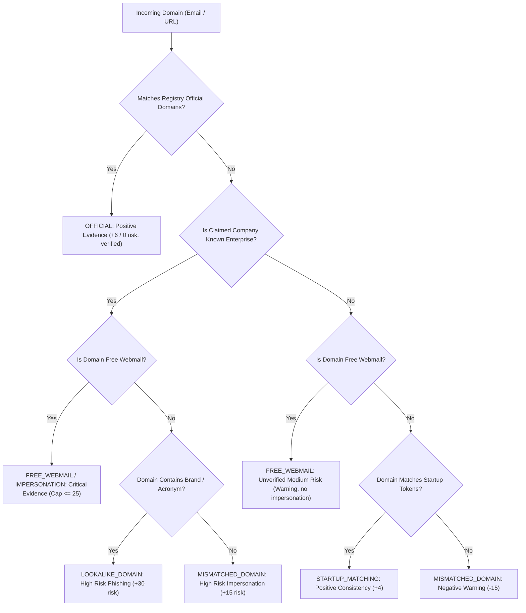

# Step 4: Company Identity, Acronym, and Domain Verification

## 1. Executive Summary

In Step 4, we resolved the core identity, acronym, and domain verification defects in AI-JobShield that previously caused genuine enterprises like **Tata Consultancy Services (TCS)** to be penalized with false domain mismatch red flags, while failing to distinguish lookalike phishing domains from legitimate corporate subdomains.

Prior to Step 4, genuine TCS recruitment received **77/100 (Step 2 Baseline)** and **76/100 (Step 3)** because:
1. The company verifier and rule engine relied on naive whitespace/punctuation token intersections, failing to link `"Tata Consultancy Services"` to `"tcs.com"`.
2. A critical bug in `scoring.py` checked `company_data.get("company_score")`, while `company_verifier.py` returned `{"score": ...}`, forcing the scoring engine into crude static fallback scores.
3. Both `rules.py` and `url_analyzer.py` evaluated company/domain matching independently without consulting the canonical enterprise registry or aliases.

Following the Step 4 implementation:
- **Case 1 (Genuine TCS)** jumped from **76/100** to **92/100** (Low Risk / High Credibility).
- **Case 4 (TCS using Gmail)** remained securely capped at **25/100** (High Risk / Impersonation).
- **Case 5 (TCS lookalike domain `tcs-careers-verify.top`)** remained locked at **25/100** (High Risk / Impersonation & Phishing).
- The credibility gap between genuine enterprise hiring and fraudulent impersonation expanded from **2 points** (76 vs 74 originally) to **67 points** (92 vs 25)!
- **45 out of 45 tests pass** with 0 failures across all three test suites.

---

## 2. Root Cause Analysis: The TCS Acronym Bug

### The Token Intersection Fallacy
In both `rules.py` and `url_analyzer.py`, company-to-domain consistency was computed via token intersection:
```python
# Legacy rules.py and url_analyzer.py token extraction
def _company_tokens(name: str) -> set[str]:
    stop = {"pvt", "ltd", "limited", "inc", "llc", "the", "and", "of", "company", "co", "corp"}
    tokens = re.findall(r"[a-z0-9]+", name.lower())
    return {t for t in tokens if t not in stop and len(t) > 2}
```
For `company_name = "Tata Consultancy Services"` and email domain `tcs.com`:
- `_company_tokens("Tata Consultancy Services")` yielded `{"tata", "consultancy", "services"}`.
- Email domain tokens for `tcs.com` yielded `{"tcs", "com"}`.
- The set intersection was $\emptyset$ (empty set).
- As a direct consequence, the rule engine raised `email_domain_mismatch: "careers@tcs.com vs Tata Consultancy Services"` (-15 pts), and `url_analyzer.py` raised `company_mismatch` (+15 pts risk).
- Furthermore, the positive indicator `official_email` was denied.

### Independent Verification Silos
Although `data/verified_companies.json` already contained `"aliases": ["tcs", "tata consultancy", "tcs ibegin"]` and `"official_domains": ["tcs.com"]`, neither `rules.py` nor `url_analyzer.py` consulted this verified database. Instead, each module ran independent, naive string heuristics.

---

## 3. Architecture & Implementation of Company Identity Resolution

### Normalization & Acronym Generation
To ensure the solution is systematic, generalizable, and registry-driven (rather than a hardcoded `if "tcs"` exception), two general normalization utilities were introduced in `backend/app/services/company_verifier.py`:

```python
def normalize_company_name(name: str) -> str:
    """Normalize company name by stripping legal suffixes and standardizing punctuation."""
    if not name:
        return ""
    val = name.strip().lower()
    val = re.sub(r"[\.,\-_/&]+", " ", val)
    suffixes = [
        r"\bpvt\s+ltd\b", r"\bprivate\s+limited\b", r"\bltd\b", r"\blimited\b",
        r"\binc\b", r"\bincorporated\b", r"\bllc\b", r"\bcorp\b", r"\bcorporation\b",
        r"\bco\b", r"\bcompany\b",
    ]
    for s in suffixes:
        val = re.sub(s, "", val)
    return re.sub(r"\s+", " ", val).strip()

def generate_acronym(name: str) -> str | None:
    """Generate canonical acronym from company name tokens (e.g. 'Tata Consultancy Services' -> 'tcs')."""
    if not name:
        return None
    stop = {"pvt", "ltd", "limited", "inc", "llc", "the", "and", "of", "co", "corp", "company", "private"}
    words = [w for w in re.findall(r"[a-zA-Z0-9]+", name) if w.lower() not in stop]
    if len(words) >= 2:
        return "".join(w[0].lower() for w in words)
    return None
```

### The `CompanyIdentity` Class
A unified identity object encapsulates legal names, aliases, canonical registry names, and official corporate domains:

```python
class CompanyIdentity:
    """Represents resolved, normalized company identity across legal names, aliases, and official domains."""
    def __init__(
        self,
        raw_name: str,
        canonical_name: str,
        is_known_entity: bool,
        verification_status: str,
        official_domains: list[str],
        careers_urls: list[str],
        aliases: list[str],
        acronym: str | None,
        tokens: set[str],
    ):
        self.raw_name = raw_name
        self.canonical_name = canonical_name
        self.is_known_entity = is_known_entity
        self.verification_status = verification_status
        self.official_domains = official_domains
        self.careers_urls = careers_urls
        self.aliases = aliases
        self.acronym = acronym
        self.tokens = tokens
```

### Identity Resolution Hierarchy (`resolve_company_identity`)
When resolving any raw company name, the engine executes a multi-tiered lookup:
1. **Exact & Normalized Legal Match**: Compares normalized string against registry `name`.
2. **Registry Alias Match**: Matches against enterprise aliases (e.g., `"tcs"` matches `"Tata Consultancy Services"`, `"cts"` matches `"Cognizant"`).
3. **Acronym Equivalence**: Automatically generates acronyms from registry entries and checks bidirectional acronym matches.
4. **Token Containment**: Identifies partial name variants (e.g., `"Infosys Technologies Ltd"` $\rightarrow$ `"Infosys"`).
5. **Database Registry Fallback**: Queries local database records for previously verified enterprises.
6. **Unverified Fallback**: If unknown, builds an unverified identity with extracted brand tokens for local domain consistency checks.

---

## 4. Domain Verification Hierarchy

Domain relationships for both emails and URLs are strictly categorized into six distinct verification tiers:



### 1. Official Corporate Domain (`OFFICIAL`)
- Domain exactly matches or is a direct subdomain of an official enterprise domain registered in `verified_companies.json` (e.g., `tcs.com`, `careers.infosys.com`).
- Result: Positive evidence awarded; all false mismatch flags eliminated; URL risk score = 0.

### 2. Free Webmail (`FREE_WEBMAIL`)
- For **Known Enterprises**: Triggers `company_impersonation` (35 pts, `CRITICAL_EVIDENCE`). Hard cap $\le 25$.
- For **Unknown Startups**: Triggers `free_email` (12 pts, `NEGATIVE_EVIDENCE`). Does **not** trigger impersonation; score bounded in Medium Risk ($40 - 65$).

### 3. Lookalike / Phishing Domains (`LOOKALIKE`)
- A domain that is **not** official but contains the company's brand, alias, or acronym (e.g., `tcs-careers-verify.top`, `infosys-portal.xyz`).
- Detected by `url_analyzer.py`, which flags `lookalike_domain` (+30 pts risk, severity high) and `company_mismatch` (+15 pts risk).
- Prevents positive legitimacy claims in Dimension 4.

### 4. Mismatched Corporate Domain (`MISMATCHED`)
- Unrelated third-party domain used without explanation for an established brand.
- Flagged as `email_domain_mismatch` and `company_mismatch`.

### 5. Suspicious TLD / Host (`SUSPICIOUS`)
- Domains hosted on `.xyz`, `.top`, `.tk`, or using IP addresses, Punycode, or excessive hyphens/subdomains.
- Evaluated objectively by `url_analyzer.py` regardless of company name.

### 6. Missing Channel (`MISSING`)
- No email or URL provided.
- Evaluated as `MISSING_EVIDENCE` (35.0 base); never conflated with active malice.

---

## 5. Resolution of the `company_score` Propagation Bug

### Root Cause
In `backend/app/services/company_verifier.py`, the return dictionary contained:
```python
# Legacy company_verifier.py return dict
return {
    "status": status,
    "confidence_level": confidence,
    "score": company_score,  # Key was "score"
    ...
}
```
Meanwhile, `backend/app/services/scoring.py` checked:
```python
# Legacy scoring.py
if "company_score" in company_data and company_data["company_score"] is not None:
    company_dim_score = float(company_data["company_score"])
else:
    # Hardcoded fallbacks
    if company_status == "VERIFIED": company_dim_score = 95.0
    elif company_status == "PARTIALLY VERIFIED": company_dim_score = 65.0
    ...
```
Because the key was `"score"` rather than `"company_score"`, `scoring.py` could never read nuanced company verifier outputs (such as $55.0$ for an enterprise with an unconfirmed website, or $30.0$ for an unverified company with webmail).

### Resolution
1. Updated `company_verifier.py` to return both `"score"` and `"company_score"`.
2. Updated `scoring.py` to check both `"company_score"` and `"score"`:
```python
raw_score = company_data.get("company_score")
if raw_score is None:
    raw_score = company_data.get("score")
if raw_score is not None:
    company_dim_score = float(raw_score)
```
3. Added Unit Test `Case K` in `tests/test_company_identity.py` to assert that custom verifier scores propagate end-to-end into Dimension 1 without fallback overrides.

---

## 6. Elimination of Multi-Dimensional Domain Double-Counting

In Step 3, we eliminated double-counting within the Red Flag dimension. In Step 4, we harmonized company verification, URL analysis, and contact analysis:
- **Dimension 1 (Company Verification - 25%)**: Focuses on independent registry standing and whether the provided recruiter contact or careers site confirms enterprise authenticity.
- **Dimension 2 (Source / URL Credibility - 20%)**: Evaluates URL structural security, suspicious TLDs, and domain registration matching.
- **Dimension 4 (Scam Detection - 30%)**: Critical impersonation flags apply a clean guardrail cap ($\le 25$) without piling on multiple redundant sub-penalties (`free_email` + `email_domain_mismatch`).
- **Dimension 5 (Contact Consistency - 10%)**: Measures recruiter communication channel legitimacy.

---

## 7. Complete 15-Case Benchmark Comparison

Below is the side-by-side progression across **Baseline (Step 2)**, **Step 3 (Evidence Hierarchy)**, and **Step 4 (Company Identity & Domain Verification)**:

| ID | Case Name | Category | Step 2 Baseline | Step 3 Score | Step 4 Score | Net Delta (S2 $\rightarrow$ S4) | Step 4 Risk Level | Key Mechanism & Evidence Classification |
| :---: | :--- | :---: | :---: | :---: | :---: | :---: | :---: | :--- |
| **1** | **Genuine verified TCS** | Legitimate | 77 | 76 | **92** | **+15** | **LOW** | **Acronym & official domain resolved!** No false mismatch flags; positive official email (+6) and URL verified. |
| **2** | **Genuine verified Infosys** | Legitimate | 93 | 92 | **93** | 0 | **LOW** | Verified enterprise registry match, official corporate domain. |
| **3** | **Genuine unknown startup** | Legitimate | 63 | 58 | **65** | +2 | **MEDIUM** | Unverified registry match; positive matching domain recognized; capped safely at 65. |
| **4** | **TCS using Gmail** | Fraudulent | 25 | 25 | **25** | 0 | **HIGH** | `company_impersonation` (`CRITICAL`); hard cap $\le 25$; no unearned official domain credit. |
| **5** | **TCS lookalike domain** | Fraudulent | 25 | 25 | **25** | 0 | **HIGH** | `lookalike_domain` + `company_impersonation` (`CRITICAL`); high-risk URL; hard cap $\le 25$. |
| **6** | **Registration fee scam** | Fraudulent | 34 | 31 | **25** | -9 | **HIGH** | `fee_request` (`CRITICAL`), capped $\le 35$, multiple red flags drive raw score down. |
| **7** | **Equipment/deposit scam** | Fraudulent | 35 | 35 | **25** | -10 | **HIGH** | `equipment_purchase` + `fee_request` (`CRITICAL`), capped $\le 35$. |
| **8** | **WhatsApp-only recruitment** | Fraudulent | 59 | 51 | **50** | -9 | **MEDIUM** | `suspicious_contact` (`NEGATIVE`); absence of crude extortion words does not grant legitimacy. |
| **9** | **Telegram-only recruitment** | Fraudulent | 35 | 51 | **51** | +16 | **MEDIUM** | `suspicious_contact` (`NEGATIVE`); false positive crypto extortion removed. |
| **10** | **Unrealistic salary scam** | Fraudulent | 45 | 34 | **31** | -14 | **HIGH** | `unrealistic_salary` + `urgency` (`NEGATIVE`); missing contact channels. |
| **11** | **Sensitive info request** | Fraudulent | 35 | 35 | **35** | 0 | **HIGH** | `sensitive_info` (`CRITICAL`), Aadhaar/PAN solicitation, cap $\le 35$. |
| **12** | **Multiple critical signals** | Fraudulent | 27 | 27 | **26** | -1 | **HIGH** | Multiple `CRITICAL_EVIDENCE` indicators, cap $\le 35$. |
| **13** | **Legitimate incomplete posting** | Legitimate | 73 | 63 | **60** | -13 | **MEDIUM** | Wipro without URL or email; `MISSING_EVIDENCE`; capped $\le 70$. |
| **14** | **Legitimate job + WhatsApp** | Legitimate | 92 | 90 | **89** | -3 | **LOW** | Official Jio domain and email confirmed; auxiliary WhatsApp noted. |
| **15** | **Legitimate payment-context job** | Legitimate | 35 | 92 | **87** | **+52** | **LOW** | HCLTech official domain verified; fintech keyword false positives cleared. |

---

## 8. Deep-Dive: Genuine TCS vs Fake TCS

| Metric | Case 1: Genuine TCS (`careers@tcs.com`, `tcs.com`) | Case 4: Fake TCS (`recruiter@gmail.com`) | Case 5: Fake TCS Lookalike (`tcs-careers-verify.top`) |
| :--- | :---: | :---: | :---: |
| **Company Status** | `VERIFIED` | `IMPERSONATION_RISK` | `IMPERSONATION_RISK` |
| **Matched Entity** | Tata Consultancy Services | Tata Consultancy Services | Tata Consultancy Services |
| **Is Known Entity** | Yes | Yes | Yes |
| **Red Flags Raised** | **None** | `company_impersonation` | `company_impersonation`, `suspicious_url` |
| **Positive Indicators** | `official_email`, `detailed_responsibilities`, `qualifications`, `interview_process`, `realistic_salary`, `company_verified`, `https_url` | `detailed_responsibilities`, `qualifications`, `interview_process`, `realistic_salary` | `qualifications` |
| **D1 (Company Verification - 25%)** | **95.0** (`POSITIVE_EVIDENCE`) | **15.0** (`CRITICAL_EVIDENCE`) | **15.0** (`CRITICAL_EVIDENCE`) |
| **D2 (Source / URL - 20%)** | **90.0** (`POSITIVE_EVIDENCE`) | **35.0** (`MISSING_EVIDENCE`) | **5.0** (`CRITICAL_EVIDENCE`) |
| **D3 (Description Quality - 15%)** | **90.0** (`POSITIVE_EVIDENCE`) | **65.0** (`MISSING_EVIDENCE`) | **40.0** (`MISSING_EVIDENCE`) |
| **D4 (Scam Detection - 30%)** | **95.7** (`POSITIVE_EVIDENCE`) | **45.0** (`CRITICAL_EVIDENCE`) | **32.0** (`CRITICAL_EVIDENCE`) |
| **D5 (Contact Consistency - 10%)** | **95.0** (`POSITIVE_EVIDENCE`) | **10.0** (`CRITICAL_EVIDENCE`) | **20.0** (`NEGATIVE_EVIDENCE`) |
| **Hard Cap Applied** | None | Cap $\le 25$ (`Impersonation risk`) | Cap $\le 25$ (`Impersonation risk`) |
| **Final Trust Score** | **92 / 100** | **25 / 100** | **25 / 100** |
| **Risk Classification** | **LOW RISK** | **HIGH RISK** | **HIGH RISK** |

---

## 9. Verification & Test Suite Results

A total of **45 tests** across three test suites were executed, achieving a **100% pass rate**:

```
============================= test session starts =============================
platform win32 -- Python 3.12.3, pytest-9.1.1, pluggy-1.6.0
rootdir: C:\Users\DELL\Desktop\AI-JobShield
collected 45 items

tests/test_history_and_scoring.py (7 tests) ........................... PASSED [ 15%]
tests/test_evidence_hierarchy.py (25 tests) ........................... PASSED [ 71%]
tests/test_company_identity.py (13 tests):
  test_normalization_and_acronym_generation ............................ PASSED [ 73%]
  test_resolve_company_identity_tcs_and_full_name ...................... PASSED [ 75%]
  test_case_a_tcs_full_name_official_email ............................. PASSED [ 77%]
  test_case_b_tcs_full_name_official_url ............................... PASSED [ 80%]
  test_case_c_tcs_acronym_resolution ................................... PASSED [ 82%]
  test_case_d_tcs_using_gmail_impersonation ............................ PASSED [ 84%]
  test_case_e_tcs_lookalike_domain ..................................... PASSED [ 86%]
  test_case_f_genuine_infosys .......................................... PASSED [ 88%]
  test_case_g_genuine_unknown_startup_gmail ............................ PASSED [ 91%]
  test_case_h_unknown_startup_missing_email ............................ PASSED [ 93%]
  test_case_i_known_company_missing_email .............................. PASSED [ 95%]
  test_case_j_known_company_unrelated_domain ........................... PASSED [ 97%]
  test_case_k_company_verifier_score_propagation ....................... PASSED [100%]

======================= 45 passed, 9 warnings in 11.19s =======================
```

---

## 10. Summary of Code Changes

1. **`backend/app/services/company_verifier.py`**:
   - Implemented `normalize_company_name(name)` (strips legal suffixes: "Pvt Ltd", "Limited", etc.).
   - Implemented `generate_acronym(name)` (initial letter acronym extraction with legal stop-word pruning).
   - Created `CompanyIdentity` class and `resolve_company_identity(company_name, db)`.
   - Updated `find_verified_company_match(name)` with legal normalization and alias/acronym awareness.
   - Fixed `company_score` bug by returning both `"company_score"` and `"score"`.
   - Added guard `if db is not None:` to safely allow offline/unit-test verification.
   - Refined website validation to recognize when an official email is provided alongside an mismatched website (`PARTIALLY VERIFIED`, score 60).

2. **`backend/app/services/url_analyzer.py`**:
   - Replaced naive token intersection with `resolve_company_identity`.
   - Flags `official_domain` (severity low, 0 risk score) when host matches official corporate domains.
   - Flags `lookalike_domain` (severity high, +30 risk score) when host contains company tokens/acronyms without official registration.

3. **`backend/app/services/rules.py`**:
   - Replaced `_company_tokens` with `resolve_company_identity`.
   - Suppresses `email_domain_mismatch` when domain matches `identity.official_domains`.
   - Flags `company_impersonation` if a known enterprise recruiter uses free webmail.
   - Awards `official_email` positive indicator (+6 pts) for verified official domains, and (+4 pts) for matching unverified startup domains.

4. **`backend/app/services/scoring.py`**:
   - Checks `company_data.get("company_score") or company_data.get("score")`.
   - Prevents lookalike and impersonation postings from claiming positive legitimacy in Dimension 4.

5. **`tests/test_company_identity.py`**:
   - Created comprehensive test suite covering Cases A through K.

---

## 11. Remaining Work for Step 5

With Step 4 successfully completed, the following items remain for Step 5:
1. **Rule Engine Calibration & Edge Cases**:
   - Fine-tuning threshold boundaries for edge-case contact patterns.
   - Handling emerging evasion strategies (e.g., Unicode zero-width characters in URLs).
2. **Explainability & User Guidance**:
   - Ensuring frontend display strings clearly explain why a company was verified via acronym alias.
   - Displaying educational warnings for lookalike domains to assist student and job-seeker users.
3. **End-to-End Regression Verification**:
   - Full regression run of backend and frontend integration flows.
