# AI JobShield — Activity Diagram

This document illustrates the operational activity flow of the job opportunity evaluation process, showing concurrent analytical forks, decision branches, guardrail evaluations, and termination states.

---

## 1. Complete Job Analysis Activity Diagram

```mermaid
flowchart TD
    StartNode([● Start: User Initiates Scan]) --> IngestionChoice{Ingestion Mode?}

    %% Mode A: Manual Ingestion
    IngestionChoice -->|Manual Input| EnterDetails["Enter Job Title, Company, Description,<br/>Salary, Contact Email, URL, Location"]
    EnterDetails --> NormalizePayload["Normalize & Sanitize Input Strings<br/>(Pydantic Validation)"]

    %% Mode B: Screenshot Ingestion
    IngestionChoice -->|Screenshot Upload| UploadFile["Upload Job Image<br/>(PNG, JPG, WEBP ≤ 5MB)"]
    UploadFile --> ValidateMime["Validate File Format & File Size"]
    ValidateMime --> PreprocessImage["Preprocess Image<br/>(Grayscale, Adaptive Scaling, Thresholding)"]
    PreprocessImage --> RunTesseract["Execute Tesseract OCR Engine<br/>(Extract Raw Text & Confidence)"]
    RunTesseract --> ExtractHints["Extract Contact Hints<br/>(Emails, URLs, Company Name, Title)"]
    ExtractHints --> ContentGateCheck["Execute Job Content Relevance Gatekeeper<br/>(job_content_validator.py)"]

    ContentGateCheck --> EvaluateGateScore{"Content Validated?<br/>Score ≥ 8 & Distinct ≥ 3<br/>& Anti-Score < 6"}

    EvaluateGateScore -->|No: Contest / Shopping / Non-job| RejectUpload["Generate Friendly Rejection Message:<br/>'Please upload a job posting, recruiter message, or resume'"]
    RejectUpload --> EndReject([◎ Terminate: 422 Unprocessable Entity])

    EvaluateGateScore -->|Yes: Verified Job Content| MergeInputs
    NormalizePayload --> MergeInputs["Construct Unified Job Analysis Payload"]

    %% Fork Concurrent Analytical Engines
    MergeInputs --> ForkEngines[═══════════ FORK CONCURRENT ANALYSES ═══════════]

    %% Analytical Branch 1: Company Verifier
    ForkEngines --> VerifyCompany["1. Company Verification:<br/>- Query Curated Enterprise Registry<br/>- Check Verified Aliases<br/>- Match Corporate Domain vs Recruiter Email"]
    VerifyCompany --> SetCompanyStatus["Determine Status:<br/>VERIFIED (95) | PARTIAL (65) |<br/>UNVERIFIED (40) | IMPERSONATION (10)"]

    %% Analytical Branch 2: URL Heuristics
    ForkEngines --> CheckUrlProvided{"URL Provided?"}
    CheckUrlProvided -->|Yes| InspectUrl["2. URL Security Heuristics:<br/>- Suspicious TLD (.xyz, .top, .tk)<br/>- Shortener Domains (bit.ly, tinyurl)<br/>- IP Hostname / Punycode<br/>- Brand Mismatch in Host"]
    CheckUrlProvided -->|No| NeutralUrl["Set Neutral Source Score (50)"]
    InspectUrl --> SetUrlScore["Determine URL Risk & Score (0 - 100)"]

    %% Analytical Branch 3: Rule Engine
    ForkEngines --> RunRuleEngine["3. Rule-Based Scam Detection:<br/>- Upfront fee / pay-to-join patterns<br/>- Equipment purchase requests<br/>- WhatsApp / Telegram-only hiring<br/>- Sensitive ID solicitations<br/>- Unrealistic salary heuristics<br/>- Positive legitimacy cues"]
    RunRuleEngine --> SetRuleOutputs["Collect Red Flags List,<br/>Positive Indicators & Bonus Points"]

    %% Analytical Branch 4: ML Classifier
    ForkEngines --> RunML["4. Machine Learning Inference:<br/>- Preprocess & Tokenize Text<br/>- Compute TF-IDF Features<br/>- Infer Scam Probability via Logistic Regression<br/>- Extract Top Influential Vocabulary Terms"]
    RunML --> SetMLOutputs["Return Scam Probability (0.0 - 1.0)<br/>& Top 8 Contributing Features"]

    %% Join Node
    SetCompanyStatus --> JoinEngines[═══════════ JOIN ANALYTICAL RESULTS ═══════════]
    SetUrlScore --> JoinEngines
    NeutralUrl --> JoinEngines
    SetRuleOutputs --> JoinEngines
    SetMLOutputs --> JoinEngines

    %% 5-Dimension Calculation
    JoinEngines --> Compute5Dimensions["Compute 5-Dimensional Weighted Base Score:<br/>• Dim 1: Company Verification (25%)<br/>• Dim 2: Source / URL Credibility (20%)<br/>• Dim 3: Job Description Quality (15%)<br/>• Dim 4: Scam & Red Flag Detection (30%)<br/>• Dim 5: Contact Consistency (10%)<br/>Raw Weighted = Σ (Weight_i × Score_i)"]

    %% Hard Cap Guardrail Decisions
    Compute5Dimensions --> CheckImpersonation{"Impersonation Risk<br/>Detected?"}
    CheckImpersonation -->|Yes| ApplyImpersonationCap["Apply Safety Cap: Score = min(Score, 25)<br/>Flag as HIGH RISK"]
    CheckImpersonation -->|No| CheckCriticalScam{"Critical Scam Indicator<br/>Present? (Fee/Money/ID)"}

    CheckCriticalScam -->|Yes| ApplyScamCap["Apply Safety Cap: Score = min(Score, 35)<br/>Flag as HIGH RISK"]
    CheckCriticalScam -->|No| CheckUnverified{"Company Unverified<br/>in Registry?"}

    CheckUnverified -->|Yes| ApplyUnverifiedCap["Apply Evidence Cap: Score = min(Score, 65)<br/>Cap at MEDIUM RISK"]
    CheckUnverified -->|No| CheckPartial{"Company Partially<br/>Verified?"}

    CheckPartial -->|Yes| ApplyPartialCap["Apply Evidence Cap: Score = min(Score, 75)"]
    CheckPartial -->|No| NoCap["Keep Uncapped Weighted Score (0 - 100)"]

    %% Merge Hard Caps
    ApplyImpersonationCap --> MergeCaps
    ApplyScamCap --> MergeCaps
    ApplyUnverifiedCap --> MergeCaps
    ApplyPartialCap --> MergeCaps
    NoCap --> MergeCaps

    MergeCaps["Determine Risk Classification:<br/>Score ≥ 75 → LOW RISK<br/>45 ≤ Score < 75 → MEDIUM RISK<br/>Score < 45 → HIGH RISK"]

    %% Synthesis & Deduplication
    MergeCaps --> SynthesizeExplanation["Synthesize Explainable Natural Language Report<br/>(Markdown Rationale, Summary, Recommendations)"]
    SynthesizeExplanation --> CheckDeduplication["Check Posting Deduplication<br/>(Cosine Similarity vs Historical Corpus)"]

    %% Persistence
    CheckDeduplication --> BeginTx["Begin Database Transaction"]
    BeginTx --> InsertJobPosting["INSERT into job_postings (title, company, description, user_id)"]
    InsertJobPosting --> InsertAnalysis["INSERT into analysis_results (trust_score, risk_level, flags, breakdown)"]
    InsertAnalysis --> CommitTx["COMMIT Transaction"]

    %% Presentation
    CommitTx --> RenderUI["Render Interactive Evaluation on Client:<br/>- Color-Coded Trust Gauge<br/>- 5-Dimension Radar/Bar Breakdown<br/>- Detected Red Flag Badges with Evidence<br/>- Actionable Safety Checklist"]
    RenderUI --> EndSuccess([◎ End: Complete Analysis Saved to History])
```

---

## 2. Activity Node Details

### Ingestion & OCR Validation Activity
* **Initial Action**: The user either fills out the structured text fields on `AnalyzePage` or uploads an image on `OcrPage`.
* **Preprocessing**: Images undergo grayscale conversion, adaptive scaling (scaling small screenshots 2x for OCR legibility), and contrast point-transformation.
* **Decision Gate (`job_content_validator.py`)**:
  * Extracted text is checked against four pattern categories: `STRONG_PATTERNS` (weight 3), `MEDIUM_PATTERNS` (weight 2), `WEAK_PATTERNS` (weight 1), and `ANTI_PATTERNS` (penalty 3 to 8).
  * If the anti-pattern score is ≥ 6 (e.g. Codeforces contest terminology, shopping carts, e-commerce order summaries) and the positive score is < 12, the activity branch terminates early, preventing invalid records from polluting user history.

### Concurrent Intelligence Fork
The orchestrator executes four independent evaluation tracks:
1. **Company Verification**: Resolves the employer name against `verified_companies.json` and database records. Identifies corporate impersonation when a known brand name (e.g. "TCS", "Infosys") is paired with personal email addresses (`@gmail.com`).
2. **URL Heuristics**: Analyzes link syntax without live network fetching, evaluating punycode, unusual TLDs, URL shorteners, and company-token mismatches.
3. **Deterministic Rules**: Runs regex pattern matching for upfront payment solicitations, equipment purchasing scams, WhatsApp-only interviews, and sensitive identity requests.
4. **Machine Learning Classifier**: Extracts TF-IDF n-grams and executes a calibrated Logistic Regression model to compute statistical scam probability.

### Guardrail Safety Caps (Decision Nodes)
Regardless of high scores in other dimensions, the system enforces non-negotiable safety guardrails:
* **Impersonation Cap**: When a brand name does not match the contact channel, the Trust Score is hard-capped at **25/100** (High Risk).
* **Critical Scam Cap**: When an upfront fee or cryptocurrency payment is demanded, the Trust Score is hard-capped at **35/100** (High Risk).
* **Unverified Cap**: When a company cannot be verified in an independent registry, the maximum achievable Trust Score is capped at **65/100** (Medium Risk), ensuring unverified entities cannot receive high-trust ratings.
