# AI JobShield — Class Diagram

This document provides the formal structural model of **AI JobShield**, detailing domain entities, service modules, data contracts, and their object-oriented relationships derived directly from the application's implementation.

---

## 1. Class Diagram

```mermaid
classDiagram
    %% =========================================================================
    %% DOMAIN ENTITIES (SQLAlchemy ORM)
    %% =========================================================================
    class User {
        +int id
        +string name
        +string email
        +string password_hash
        +string role
        +bool is_verified
        +datetime created_at
        +datetime updated_at
        +email_verified() bool
    }

    class EmailOtp {
        +int id
        +int user_id
        +string otp_hash
        +string purpose
        +datetime expires_at
        +int attempts
        +datetime created_at
        +datetime updated_at
    }

    class Company {
        +int id
        +string name
        +string domain
        +string verification_status
        +datetime last_checked_at
        +string notes
    }

    class JobPosting {
        +int id
        +int user_id
        +string title
        +int company_id
        +string company_name
        +string description
        +string salary
        +string email
        +string url
        +string location
        +string job_type
        +string source
        +datetime created_at
    }

    class AnalysisResult {
        +int id
        +int job_posting_id
        +int user_id
        +int trust_score
        +string risk_level
        +float ml_scam_probability
        +float rule_risk_points
        +string red_flags
        +string positive_indicators
        +string explanation
        +string company_verification
        +string url_analysis
        +string duplicate_result
        +string score_breakdown
        +string extracted_ocr_text
        +datetime created_at
    }

    class OcrResult {
        +int id
        +int user_id
        +string image_filename
        +string extracted_text
        +bool ocr_available
        +float confidence
        +int analysis_result_id
        +datetime created_at
    }

    class DuplicateMatch {
        +int id
        +int analysis_result_id
        +string matched_source_type
        +int matched_id
        +float similarity
        +datetime created_at
    }

    class Feedback {
        +int id
        +int analysis_result_id
        +int user_id
        +string label
        +string comment
        +datetime created_at
    }

    class ScamReport {
        +int id
        +int user_id
        +string job_title
        +string company_name
        +string description
        +string url
        +string reason
        +string screenshot_path
        +datetime report_date
        +string status
    }

    %% =========================================================================
    %% SERVICE MODULES & ANALYTICAL ENGINES
    %% =========================================================================
    class AnalyzerService {
        +run_analysis(db, user_id, title, company_name, description, ...) dict
        +serialize_analysis(analysis, posting, ml) dict
    }

    class CompanyVerifierService {
        +verify_company(db, company_name, email, website) dict
        +find_verified_company_match(name) dict
        -_tokens(name) set
        -_clean_domain(domain_or_email) str
    }

    class RuleEngineService {
        +RULE_WEIGHTS dict
        +analyze_rules(title, company_name, description, ...) tuple
        -_flag(rule_id, evidence, points_override) dict
        -_find_first(patterns, text) str
    }

    class MLService {
        -_state dict
        +load_model() bool
        +is_available() bool
        +predict(text) dict
        -_top_contributing_terms(pipe, clean, k) list
        +preprocess(text) str
    }

    class ScoringService {
        +compute_trust_score(red_flags, positive_bonus, ml_scam_prob, ...) dict
        +clamp(value, lo, hi) float
    }

    class ExplainService {
        +build_explanation(trust_score, risk_level, red_flags, ...) str
        +DISCLAIMER str
    }

    class OcrService {
        +resolve_tesseract_cmd() str
        +ocr_available() bool
        +extract_hints(text) dict
        +save_and_ocr(file_bytes, filename, content_type) dict
        -_preprocess(img) Image
    }

    class JobContentValidator {
        +validate_job_related_text(text) dict
        -_find_matches(patterns, text, weight) list
        +MIN_SCORE int
        +MIN_DISTINCT_SIGNALS int
    }

    class UrlAnalyzerService {
        +analyze_url(url, company_name) dict
        -_suspicious_tlds() set
        -_normalize_company(name) set
    }

    class EmailService {
        +send_otp_email(to_email, otp_code, purpose) bool
        +generate_otp() str
        +verify_otp(db, user_id, otp_code, purpose) bool
        +smtp_configured() bool
        +smtp_status() dict
    }

    %% =========================================================================
    %% ENTITY RELATIONSHIPS
    %% =========================================================================
    User "1" *-- "0..*" EmailOtp : issues
    User "1" o-- "0..*" JobPosting : creates
    User "1" o-- "0..*" AnalysisResult : owns
    User "1" o-- "0..*" OcrResult : uploads
    User "1" o-- "0..*" ScamReport : submits
    User "1" o-- "0..*" Feedback : provides

    Company "0..1" -- "0..*" JobPosting : references

    JobPosting "1" *-- "1" AnalysisResult : evaluated_by

    AnalysisResult "1" *-- "0..*" DuplicateMatch : identifies
    AnalysisResult "1" *-- "0..1" Feedback : receives
    AnalysisResult "0..1" -- "0..1" OcrResult : derived_from

    %% =========================================================================
    %% SERVICE DEPENDENCY ASSOCIATIONS
    %% =========================================================================
    AnalyzerService ..> CompanyVerifierService : calls
    AnalyzerService ..> RuleEngineService : calls
    AnalyzerService ..> MLService : calls
    AnalyzerService ..> ScoringService : calls
    AnalyzerService ..> ExplainService : calls
    AnalyzerService ..> UrlAnalyzerService : calls
    AnalyzerService ..> AnalysisResult : creates
    AnalyzerService ..> JobPosting : creates

    OcrService ..> JobContentValidator : validates
    OcrService ..> OcrResult : records
```

---

## 2. Entity Descriptions & Database Attributes

### A. `User` Entity
* **Table**: `users`
* **Purpose**: Manages user accounts, authentication state, role-based authorization, and account verification.
* **Key Attributes**:
  * `id`: Integer, primary key, auto-incrementing.
  * `email`: String(255), unique, indexed, case-normalized.
  * `password_hash`: String(255), Bcrypt salted hash.
  * `role`: String(20), defaults to `"user"`, supports `"admin"`.
  * `is_verified`: Boolean, indicates whether the user completed Email OTP confirmation.

### B. `EmailOtp` Entity
* **Table**: `email_otps`
* **Purpose**: Manages short-lived one-time passwords for email verification and password recovery.
* **Key Attributes**:
  * `user_id`: Integer, foreign key referencing `users.id` with `ondelete="CASCADE"`.
  * `otp_hash`: String(255), SHA-256 hash of the 6-digit numeric OTP.
  * `purpose`: String(40), either `"verification"` or `"reset"`.
  * `expires_at`: DateTime(timezone=True), 15-minute validity window.
  * `attempts`: Integer, incremented on failed attempts to enforce brute-force lockouts.

### C. `Company` Entity
* **Table**: `companies`
* **Purpose**: Represents recognized enterprise entities and historical company audit records.
* **Key Attributes**:
  * `name`: String(255), indexed company name.
  * `domain`: String(255), corporate official domain (e.g. `infosys.com`).
  * `verification_status`: String(40), status classification (`VERIFIED`, `PARTIALLY VERIFIED`, `UNVERIFIED`, `IMPERSONATION_RISK`).
  * `last_checked_at`: DateTime, timestamp of latest verification event.

### D. `JobPosting` Entity
* **Table**: `job_postings`
* **Purpose**: Stores job opportunity parameters submitted by users for auditing, deduplication, and historical comparison.
* **Key Attributes**:
  * `user_id`: Integer, foreign key referencing `users.id` with `ondelete="CASCADE"`.
  * `title`: String(255), job title.
  * `company_name`: String(255), claimed employer name.
  * `description`: Text, full job description text.
  * `salary`: String(120), stated salary or compensation phrase.
  * `email`: String(255), recruiter contact email.
  * `url`: String(500), source application URL.
  * `source`: String(20), ingestion origin (`"manual"`, `"ocr"`, or `"SEED_DEMO"`).

### E. `AnalysisResult` Entity
* **Table**: `analysis_results`
* **Purpose**: Stores the comprehensive analytical output for each job posting scan.
* **Key Attributes**:
  * `job_posting_id`: Integer, foreign key referencing `job_postings.id` (`1:1` relationship).
  * `user_id`: Integer, foreign key referencing `users.id` (enables indexed user isolation).
  * `trust_score`: Integer, final credibility rating (0 to 100).
  * `risk_level`: String(20), risk category (`"LOW"`, `"MEDIUM"`, `"HIGH"`).
  * `ml_scam_probability`: Float, calibrated statistical scam likelihood from ML classifier.
  * `rule_risk_points`: Float, cumulative penalty points from triggered heuristic rules.
  * `red_flags`: Text (JSON string), list of detected scam patterns with evidence snippets.
  * `positive_indicators`: Text (JSON string), list of legitimate attributes with bonuses.
  * `score_breakdown`: Text (JSON string), 5-dimensional scores, weights, and hard cap reasons.
  * `explanation`: Text, markdown-formatted structured natural language explanation.

### F. `OcrResult` Entity
* **Table**: `ocr_results`
* **Purpose**: Persists raw OCR extractions and image file references for auditability.
* **Key Attributes**:
  * `image_filename`: String(255), stored file name inside `uploads/` directory.
  * `extracted_text`: Text, raw text recognized by Tesseract.
  * `confidence`: Float, average word confidence percentage.
  * `analysis_result_id`: Integer, foreign key linking extraction to resulting analysis.

---

## 3. Analytical Engine & Service Class Responsibilities

| Service Class | File | Responsibility |
| :--- | :--- | :--- |
| **`AnalyzerService`** | `services/analyzer.py` | Orchestrates end-to-end analytical workflow: coordinates company verification, heuristic rules, ML inference, scoring, explainability, duplicate detection, and database transactions. |
| **`CompanyVerifierService`** | `services/company_verifier.py` | Cross-checks employer names against curated enterprise databases (`verified_companies.json`) and evaluates email/web domain consistency. |
| **`RuleEngineService`** | `services/rules.py` | Evaluates 14 deterministic scam patterns (upfront fees, equipment purchase, personal webmail, WhatsApp-only contact, urgency) and awards positive legitimacy bonuses. |
| **`MLService`** | `services/ml_service.py` | Manages TF-IDF vectorization and Logistic Regression inference; extracts top contributing scam vocabulary terms for explainability. |
| **`ScoringService`** | `services/scoring.py` | Aggregates 5 weighted dimensions (Company 25%, Source 20%, Quality 15%, Scam 30%, Contact 10%) and applies strict evidence-based safety caps. |
| **`ExplainService`** | `services/explain.py` | Translates raw scores and flags into human-readable, actionable natural language rationale. |
| **`JobContentValidator`** | `services/job_content_validator.py` | Content relevance gatekeeper: calculates job vocabulary weights vs anti-patterns (coding problems, shopping, social media) to reject irrelevant screenshots. |
| **`OcrService`** | `services/ocr_service.py` | Image preprocessing (scaling, grayscale, thresholding) and Tesseract OCR integration with metadata hint extraction. |
| **`UrlAnalyzerService`** | `services/url_analyzer.py` | Inspects URLs using 10+ local security heuristics (TLD reputation, shorteners, punycode, IP hostnames, keyword anomalies). |
| **`EmailService`** | `services/email_service.py` | Manages SMTP TLS delivery of 6-digit OTP verification codes with console fallback for local development. |
