# AI JobShield — Component Diagram

This document illustrates the internal component modularity of **AI JobShield**, highlighting separation of concerns across presentation, routing, business logic, security rules, and data access layers.

---

## 1. Component Modularity Diagram

```mermaid
graph TB
    %% =========================================================================
    %% CLIENT LAYER
    %% =========================================================================
    subgraph Client_Presentation ["Client Presentation Layer (React 18 + Vite)"]
        NavbarComp["Navbar.jsx"]
        AuthView["AuthPage.jsx"]
        DashView["Dashboard.jsx"]
        AnalyzeView["AnalyzePage.jsx"]
        OcrView["OcrPage.jsx"]
        ResultView["ResultPage.jsx"]
        HistoryView["HistoryPage.jsx"]
        ProfileView["ProfilePage.jsx"]
        TrustGauge["TrustGauge.jsx"]
        FeedbackWidget["FeedbackWidget.jsx"]
        AnalysisResultView["AnalysisResultView.jsx"]
        AuthContext["AuthContext.jsx (State & Token)"]
        AxiosClient["client.js (Axios Instance & Interceptors)"]

        AnalyzeView --> AnalysisResultView
        ResultView --> AnalysisResultView
        OcrView --> AnalysisResultView
        AnalysisResultView --> TrustGauge
        AnalysisResultView --> FeedbackWidget
        AuthView --> AuthContext
        DashView --> AxiosClient
        AnalyzeView --> AxiosClient
        OcrView --> AxiosClient
        HistoryView --> AxiosClient
    end

    %% =========================================================================
    %% API GATEWAY
    %% =========================================================================
    subgraph Gateway_Layer ["API & Ingestion Gateway (FastAPI)"]
        AppMain["app/main.py (FastAPI App & Lifespan)"]
        CORSMiddleware["CORSMiddleware (Origin Policy)"]
        ReqValidation["Request / Response Validation (Pydantic)"]
        AuthMiddleware["deps.py (OAuth2 Bearer Dependency)"]

        subgraph APIRouters ["API Routers (app/routers/)"]
            RouterAuth["auth.py (/api/auth)"]
            RouterAnalyze["analyze.py (/api/analyze)"]
            RouterOCR["ocr.py (/api/ocr)"]
            RouterHistory["history.py (/api/history)"]
            RouterCompany["company.py (/api/company)"]
            RouterURL["url.py (/api/url)"]
            RouterDashboard["dashboard.py (/api/dashboard)"]
            RouterReports["reports.py (/api/reports)"]
            RouterFeedback["feedback.py (/api/feedback)"]
        end

        AppMain --> CORSMiddleware
        AppMain --> ReqValidation
        AppMain --> APIRouters
    end

    AxiosClient -->|JSON over HTTP / REST| APIRouters

    %% =========================================================================
    %% CORE ANALYTICAL SERVICES
    %% =========================================================================
    subgraph CoreServices ["Core Analytical & Security Engines (app/services/)"]
        AnalyzerOrchestrator["analyzer.py<br/>(Analytical Orchestrator)"]
        CompanyVerifier["company_verifier.py<br/>(Enterprise Registry & Domain Matcher)"]
        RuleEngine["rules.py<br/>(14 Deterministic Scam Rules)"]
        MLService["ml_service.py<br/>(TF-IDF + SGD Logistic Regression)"]
        ScoringEngine["scoring.py<br/>(5D Weighted Rating & Safety Caps)"]
        ExplainEngine["explain.py<br/>(Explainable AI Natural Language Builder)"]
        OcrServiceEngine["ocr_service.py<br/>(Image Preprocessing & Tesseract Pipe)"]
        ContentValidator["job_content_validator.py<br/>(Relevance Gatekeeper)"]
        UrlAnalyzerEngine["url_analyzer.py<br/>(Local Link Heuristics)"]
        DuplicateService["duplicate.py<br/>(TF-IDF Cosine Deduplication)"]
        EmailServiceEngine["email_service.py<br/>(SMTP Relay & OTP Generator)"]
    end

    RouterAuth --> EmailServiceEngine
    RouterAnalyze --> AnalyzerOrchestrator
    RouterOCR --> OcrServiceEngine
    RouterOCR --> ContentValidator
    RouterOCR --> AnalyzerOrchestrator
    RouterHistory --> AnalyzerOrchestrator
    RouterCompany --> CompanyVerifier
    RouterURL --> UrlAnalyzerEngine

    AnalyzerOrchestrator --> CompanyVerifier
    AnalyzerOrchestrator --> UrlAnalyzerEngine
    AnalyzerOrchestrator --> RuleEngine
    AnalyzerOrchestrator --> MLService
    AnalyzerOrchestrator --> ScoringEngine
    AnalyzerOrchestrator --> ExplainEngine
    AnalyzerOrchestrator --> DuplicateService

    %% =========================================================================
    %% DATA & STORAGE LAYER
    %% =========================================================================
    subgraph DataStorage ["Data & Knowledge Layer"]
        SQLAlchemyORM["app/models.py (SQLAlchemy 2.0 ORM)"]
        DBEngine["app/database.py (Engine & SessionLocal)"]
        RelationalDB[("MySQL 8.0 / SQLite Database")]
        VerifiedJSON[("verified_companies.json")]
        FreeDomainsJSON[("free_email_domains.json")]
        SuspiciousTLDsJSON[("suspicious_tlds.json")]
        TrainedModel[("models/jobshield_model.joblib")]
        UploadedImages["uploads/ Directory"]
    end

    AnalyzerOrchestrator --> SQLAlchemyORM
    RouterHistory --> SQLAlchemyORM
    RouterAuth --> SQLAlchemyORM
    RouterDashboard --> SQLAlchemyORM
    RouterReports --> SQLAlchemyORM
    RouterFeedback --> SQLAlchemyORM
    SQLAlchemyORM --> DBEngine
    DBEngine --> RelationalDB

    CompanyVerifier --> VerifiedJSON
    RuleEngine --> FreeDomainsJSON
    UrlAnalyzerEngine --> SuspiciousTLDsJSON
    MLService --> TrainedModel
    OcrServiceEngine --> UploadedImages

    %% =========================================================================
    %% EXTERNAL SYSTEMS
    %% =========================================================================
    subgraph External_Systems ["External Runtime Systems"]
        TesseractBinary["Tesseract OCR Binary (tesseract.exe)"]
        SMTPRelay["Google Gmail SMTP Relay (smtp.gmail.com:587)"]
    end

    OcrServiceEngine --> TesseractBinary
    EmailServiceEngine --> SMTPRelay
```

---

## 2. Component Specifications & Interfaces

| Component | Layer | Module File | Key Input | Output / Effect | Dependencies |
| :--- | :--- | :--- | :--- | :--- | :--- |
| **`TrustGauge.jsx`** | Presentation | `frontend/src/components/TrustGauge.jsx` | Numeric trust score (0–100), risk level | Interactive SVG circular gauge with color-coded safety indicators | React |
| **`AnalysisResultView.jsx`** | Presentation | `frontend/src/components/AnalysisResultView.jsx` | Full analysis dictionary | Renders trust score, 5D breakdown, red flag evidence cards, and action checklist | `TrustGauge`, `FeedbackWidget` |
| **`AuthContext.jsx`** | Presentation | `frontend/src/context/AuthContext.jsx` | User login/logout actions | Provides global user state, token persistence, and route protection | React Context, LocalStorage |
| **`client.js`** | Presentation | `frontend/src/api/client.js` | Outgoing HTTP requests | Attaches `Authorization: Bearer <JWT>` header; handles 401 unauth redirects | Axios |
| **`analyzer.py`** | Analytical | `backend/app/services/analyzer.py` | Validated job parameters, `user_id`, DB session | Coordinates analysis, scoring, explanation, and database persistence | All analytical services, SQLAlchemy |
| **`company_verifier.py`** | Analytical | `backend/app/services/company_verifier.py` | Company name, email, website | Identification status, domain mismatch warnings, company dimension score | `verified_companies.json`, `Company` table |
| **`rules.py`** | Analytical | `backend/app/services/rules.py` | Full concatenated job text, salary, contact | Triggered red flags with evidence snippets, positive indicators, bonus | `free_email_domains.json`, `RULE_WEIGHTS` |
| **`ml_service.py`** | Analytical | `backend/app/services/ml_service.py` | Cleaned job text | Probability of recruitment fraud, top 8 influential vocabulary tokens | `jobshield_model.joblib`, Scikit-Learn |
| **`scoring.py`** | Analytical | `backend/app/services/scoring.py` | Dimension outputs, flags, positives, ML probability | Final Trust Score (0–100), Risk Level (`LOW`/`MED`/`HIGH`), breakdown | `app/config.py` |
| **`job_content_validator.py`**| Analytical | `backend/app/services/job_content_validator.py`| Extracted OCR text | Boolean relevance decision, signal scores, user-facing error message | Regex vocabulary patterns |
| **`ocr_service.py`** | Analytical | `backend/app/services/ocr_service.py` | Uploaded image bytes | Preprocessed image, raw text, word confidence, extracted hints | Pillow, Pytesseract, Tesseract binary |
| **`url_analyzer.py`** | Analytical | `backend/app/services/url_analyzer.py` | URL string, company name | Link validity, risk level, heuristic indicators (punycode, shortener, TLD) | `suspicious_tlds.json` |
| **`email_service.py`** | Analytical | `backend/app/services/email_service.py` | Recipient email, 6-digit OTP, purpose | Dispatches email over TLS SMTP with console fallback for local development | Python `smtplib`, `email.mime` |
| **`models.py`** | Persistence | `backend/app/models.py` | Python ORM declarations | Defines 9 database tables, foreign keys, cascades, and indexed relationships | SQLAlchemy 2.0 |
