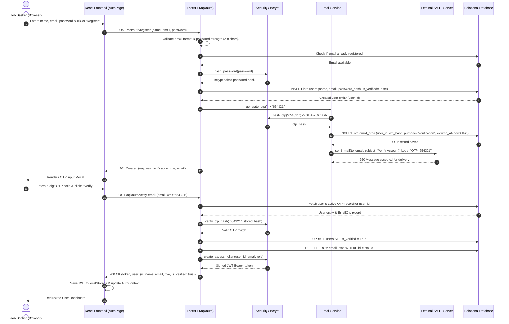
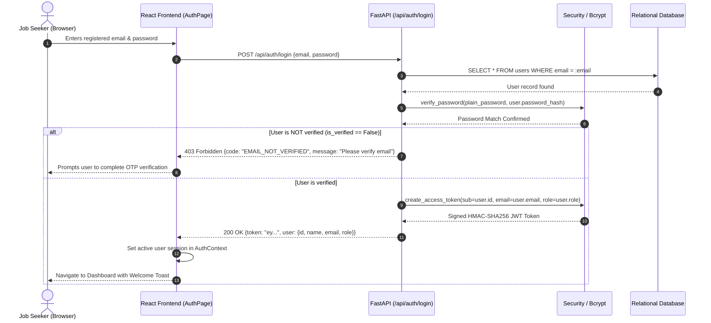
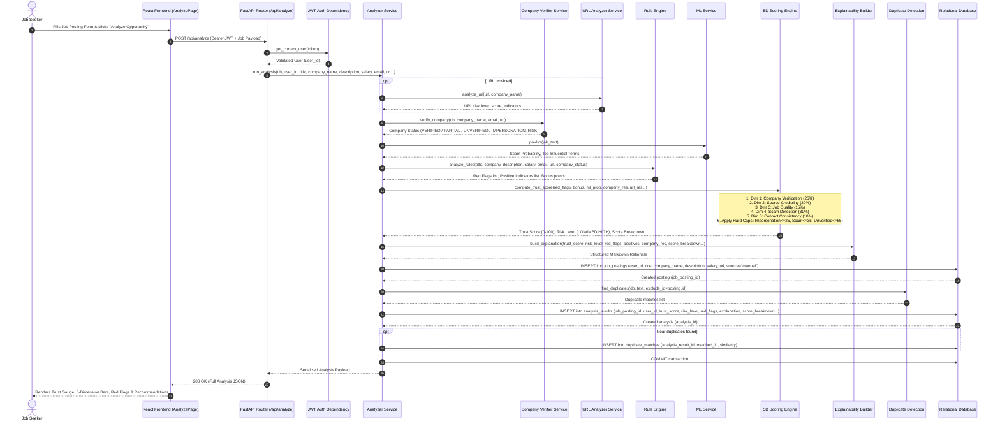
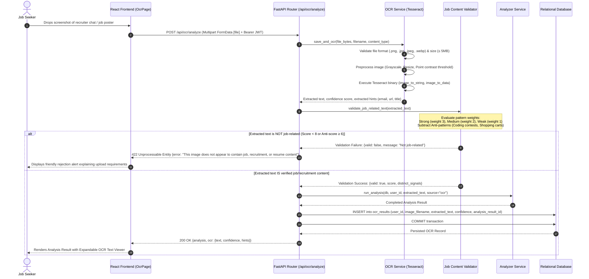
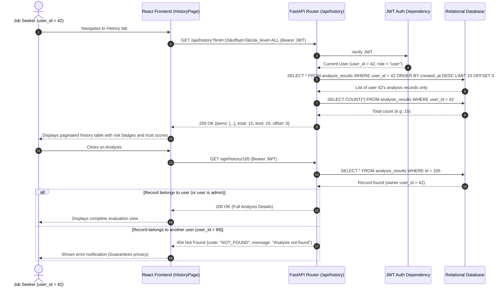
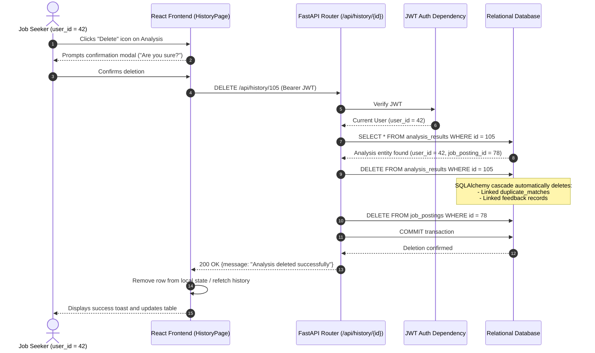

# AI JobShield — Sequence Diagrams

This document details the time-ordered interactions across the Client Layer, API Gateway, Analytical Services, Database, and External Subsystems for all major workflows in **AI JobShield**.

---

## 1. Sequence Diagram: User Registration & Email OTP Verification

---

## 2. Sequence Diagram: User Login & JWT Authentication

---

## 3. Sequence Diagram: Manual Job Posting Analysis & 5D Scoring

---

## 4. Sequence Diagram: OCR Screenshot Scanning & Relevance Gatekeeper

---

## 5. Sequence Diagram: Browse Scan History & User Isolation

---

## 6. Sequence Diagram: Delete Analysis Record & Cascade Deletion

