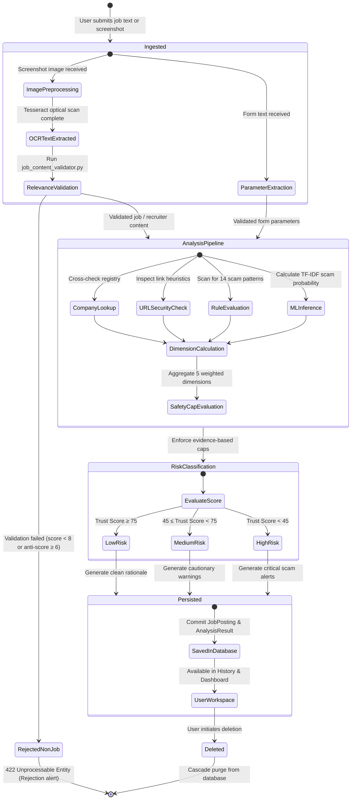
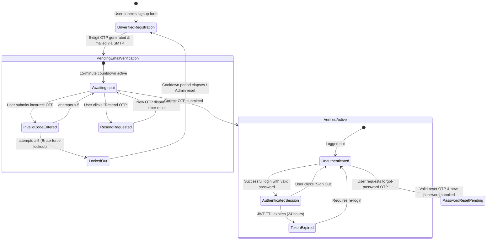
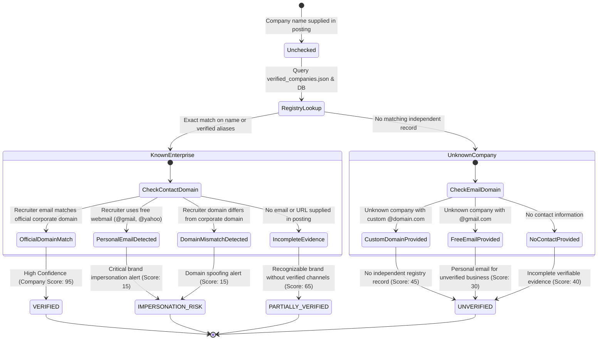
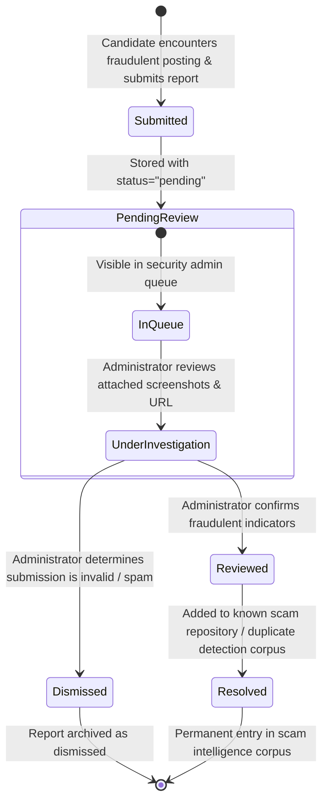

# AI JobShield — State Machine Diagrams

This document models the dynamic state transitions, triggers, guard conditions, and lifecycles for entities with state-dependent behavior in **AI JobShield**.

---

## 1. Job Opportunity Analysis & Risk Lifecycle

This state machine models how an ingested job posting traverses through preprocessing, gate validation, concurrent evaluation, risk categorization, and archival.

---

## 2. User Account & Authentication Lifecycle

---

## 3. Company Verification State Machine

---

## 4. Community Scam Report Lifecycle

