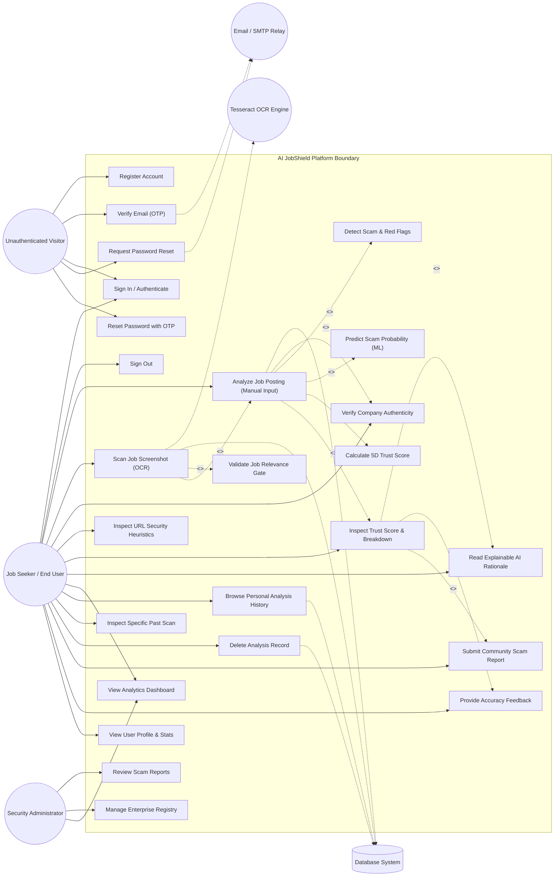

# AI JobShield — Use Case Diagram

This document defines the system actors, functional use cases, actor-to-use-case associations, use case relationships (`<<include>>` and `<<extend>>`), and formal use case specifications for the **AI JobShield** platform.

---

## 1. System Actors

In accordance with the actual implementation of AI JobShield, the system incorporates the following actors:

| Actor | Type | Description |
| :--- | :--- | :--- |
| **Job Seeker / End User** | Human Actor | The primary end user who registers, authenticates via Email OTP, submits job postings for credibility analysis, uploads job screenshots for OCR scanning, examines risk indicators, and manages past scan history. |
| **Security Administrator** | Human Actor | Administrative user (`role="admin"`) who oversees community scam reports, reviews system-wide dashboard metrics, and maintains verified company registry entries. |
| **Unauthenticated Visitor (Guest)** | Human Actor | Any prospective user visiting the public landing page, reading the security education guides, or registering a new account. |
| **Tesseract OCR Engine** | Secondary / External System | Local optical character recognition subsystem executing image preprocessing and text extraction from job screenshots. |
| **Email / SMTP Relay** | Secondary / External System | Mail transfer agent (`smtp.gmail.com` or configured SMTP server) responsible for delivering one-time passwords (OTP) for account verification and password resets. |
| **Relational Database** | Secondary / External System | MySQL / SQLite database engine persisting user credentials, OTP tokens, job postings, analysis results, and audit trails. |

---

## 2. Use Case Diagram

---

## 3. Detailed Use Case Specifications

### UC-01: User Registration and Email OTP Verification
* **Primary Actor**: Unauthenticated Visitor (Guest)
* **Secondary Actor**: Email / SMTP Relay, Relational Database
* **Pre-Conditions**: User has a valid email address and network connectivity.
* **Trigger**: User fills the registration form and clicks "Create Account".
* **Main Success Scenario**:
  1. User submits full name, email, and password (≥ 8 chars with letters, numbers, or special chars).
  2. Gateway validates payload schemas via Pydantic (`RegisterRequest`).
  3. Backend generates salted Bcrypt hash of password.
  4. Backend creates an unverified `User` entity (`is_verified=False`).
  5. Email service generates a cryptographically secure 6-digit OTP, hashes it with SHA-256, and stores an `EmailOtp` record with a 15-minute expiry.
  6. Email service delivers the OTP code to the user's inbox via SMTP.
  7. User enters the received 6-digit OTP in the verification modal.
  8. Backend validates the OTP hash, marks `User.is_verified=True`, and issues a signed JWT Bearer token.
* **Alternative Scenario (Brute Force Prevention)**:
  * If the user enters an invalid OTP 5 times, the OTP record is locked/expired, preventing automated enumeration attacks.
* **Post-Conditions**: User account is verified; authenticated session is established.

---

### UC-02: Manual Job Opportunity Analysis
* **Primary Actor**: Authenticated Job Seeker
* **Secondary Actor**: Relational Database
* **Pre-Conditions**: User is logged in with a valid Bearer JWT. Minimum 30 characters of job text provided.
* **Trigger**: User clicks "Analyze Opportunity" on the `AnalyzePage`.
* **Main Success Scenario**:
  1. User enters Job Title, Company Name, Job Description, and optional fields (Salary, Contact Email, Job URL, Location, Job Type).
  2. Router `/api/analyze` parses and sanitizes inputs.
  3. `company_verifier.py` evaluates the company name against the verified enterprise registry and checks domain consistency.
  4. `url_analyzer.py` runs local heuristic inspection if a URL was provided (TLD, shorteners, length, punycode).
  5. `ml_service.py` vectorizes input text using TF-IDF and computes scam probability via Logistic Regression.
  6. `rules.py` executes 14 deterministic red-flag patterns and positive indicator checks.
  7. `scoring.py` computes the 5-dimensional weighted score (25% Company, 20% Source, 15% Quality, 30% Scam, 10% Contact).
  8. Guardrail hard caps are applied (Impersonation ≤ 25, Critical Scam ≤ 35, Unverified ≤ 65).
  9. `explain.py` generates natural language explanation with bulleted evidence.
  10. Transaction persists `JobPosting` and `AnalysisResult` entities linked to `user_id`.
  11. Frontend renders interactive `TrustGauge`, dimension bars, red flags, and positives.
* **Post-Conditions**: Analysis result is permanently archived under user's history.

---

### UC-03: Scan Job Screenshot (OCR Pipeline)
* **Primary Actor**: Authenticated Job Seeker
* **Secondary Actor**: Tesseract OCR Engine, Relational Database
* **Pre-Conditions**: User possesses an image screenshot (PNG, JPG, JPEG, WEBP ≤ 5 MB).
* **Trigger**: User drags and drops an image into `OcrPage`.
* **Main Success Scenario**:
  1. Frontend uploads image via `multipart/form-data` to `/api/ocr/analyze`.
  2. `ocr_service.py` validates MIME type, saves image with a UUID filename to `uploads/`, and preprocesses the image (grayscale, adaptive scaling, contrast thresholding).
  3. Tesseract OCR binary extracts text, word-level confidence metrics, and contact hints (emails, URLs, company keywords).
  4. `job_content_validator.py` evaluates extracted text against strong, medium, weak, and anti-patterns (coding contests, shopping receipts, social media).
  5. If validation passes (score ≥ 8, distinct signals ≥ 3, anti-score < 6), the text is forwarded to the analytical pipeline (`UC-02`).
  6. Backend persists `OcrResult` and returns both OCR metadata and credibility analysis.
* **Exception Scenario (Non-Job Imagery)**:
  * If the image contains a coding problem (e.g. Codeforces), shopping receipt, or casual screenshot, the content validator rejects the upload with code 422: *"This image does not appear to contain job, recruitment, resume, or employment-related content."*
* **Post-Conditions**: Verified job image is analyzed and linked to user history.

---

### UC-04: Browse Personal Scan History
* **Primary Actor**: Authenticated Job Seeker
* **Secondary Actor**: Relational Database
* **Pre-Conditions**: User is logged in.
* **Trigger**: User navigates to `HistoryPage`.
* **Main Success Scenario**:
  1. Frontend sends `GET /api/history?limit=10&offset=0` with Bearer token.
  2. Gateway extracts `current_user.id`.
  3. Database executes indexed query: `WHERE user_id = :id ORDER BY created_at DESC`.
  4. Result set returns paginated records including title, company, trust score, risk level, and timestamp.
  5. User can filter by Risk Level (`ALL`, `LOW`, `MEDIUM`, `HIGH`) or search by keyword.
  6. Clicking a history item opens full analysis breakdown (`UC-05`).
* **Security Guardrail (User Isolation)**:
  * Non-admin users cannot access or view another user's scan records (`404 NOT_FOUND` returned if `analysis.user_id != current_user.id`).
* **Post-Conditions**: User reviews their historical verification activity.

---

### UC-05: Delete Analysis Record
* **Primary Actor**: Authenticated Job Seeker
* **Secondary Actor**: Relational Database
* **Pre-Conditions**: Target analysis record exists and belongs to the authenticated user.
* **Trigger**: User clicks "Delete" on a history card and confirms deletion modal.
* **Main Success Scenario**:
  1. Client sends `DELETE /api/history/{analysis_id}` with Bearer token.
  2. Backend verifies ownership (`analysis.user_id == current_user.id`).
  3. Database deletes `AnalysisResult`; SQLAlchemy cascade deletes associated `DuplicateMatch` and `Feedback` child records.
  4. Backend deletes linked `JobPosting` entity.
  5. Returns `{"message": "Analysis deleted successfully"}`.
* **Post-Conditions**: Record is removed from database; history view refreshes.
